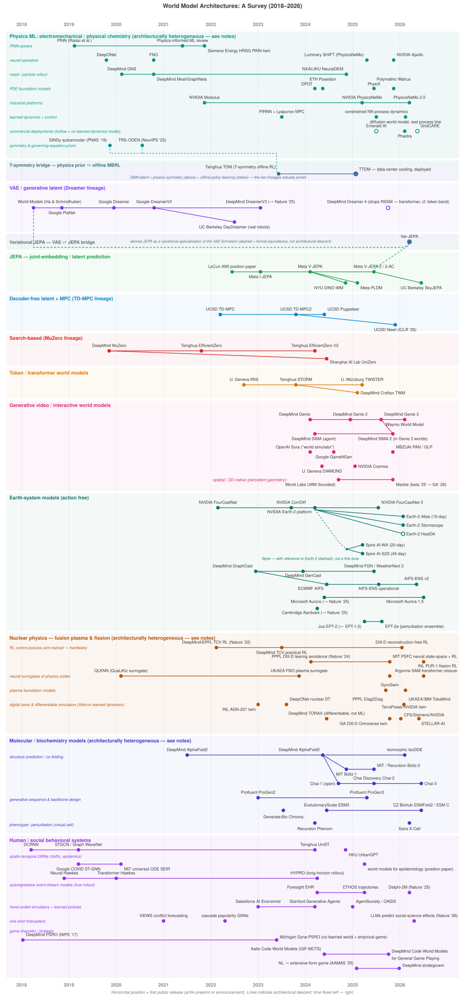

# World Model Architectures: A Survey (2018–2026)

Author: Nathan Murthy (assisted with Claude, Gemini)
Last Edit: 12 Aug 2026

Many recent surveys already exist covering the massively expansive literature base on *world models* [35, 137, 180]. This survey relies on the author's own familiarity of the subject matter and starts with ([§1](#1-definition)) their own  definition, ([§2](#2-architecture-families)) an exploration of model families and common lineages according to known research domains, ([§3](#3-applied-research)) a short exposition of applied research directions relevant to the author’s experience, and ([§4](#4-open-problems-and-outlook)) some open problems in the research field worth actively monitoring and addressing.

Whereas large language models (LLMs) have dominated the narrative on Artificial Intelligence (AI) over the last four years and even reversed popular perception of AI, from ridicule (in some technical and academic circles) to vogue, the ubiquity and availability of these models today have exposed their nearly universally well-understood limitations. At a fundamental level, AI models based solely on LLMs have no real capabilities to reason about anything outside the structure of language. AI research has accelerated to investigate, create, and evaluate models that learn the structure of phenomena in the world, to build machines and agentic systems that can reason about the world beyond what language alone can offer. It is generally regarded in many leading research, engineering, and venture capital communities that world models are the next burgeoning frontier of AI [67].

## Contents

- [1. Definition](#1-definition)
  - [1.1 What is a world model?](#11-what-is-a-world-model)
  - [1.2 A brief history](#12-a-brief-history)
    - [2018–2022: recurrent latents, small compute, one problem at a time](#20182022-recurrent-latents-small-compute-one-problem-at-a-time)
    - [2022–present: transformers, diffusion, and the shift from sample efficiency to scale](#2022present-transformers-diffusion-and-the-shift-from-sample-efficiency-to-scale)
- [2. Architecture families](#2-architecture-families)
  - [2.1 Physics ML: electromechanical / physical chemistry](#21-physics-ml-electromechanical--physical-chemistry-type-i-in-the-rollout-branch-mostly-solver-replacement-plus-the-one-branch-that-reaches-control)
  - [2.2 VAE / generative latent: the Dreamer lineage](#22-vae--generative-latent-the-dreamer-lineage-type-ii--mbrl-imagination-based-policy-learning)
  - [2.3 The Var-JEPA bridge](#23-the-var-jepa-bridge-unifying-vae-and-jepa-in-theory)
  - [2.4 JEPA: joint-embedding / latent prediction](#24-jepa-joint-embedding--latent-prediction-type-i-pretraining--type-ii-via-action-conditioning--mbrlmpc)
  - [2.5 Decoder-free latent + MPC: the TD-MPC lineage](#25-decoder-free-latent--mpc-the-td-mpc-lineage-type-ii--mpc-online-planning-for-continuous-control)
  - [2.6 Search-based: the MuZero lineage](#26-search-based-the-muzero-lineage-type-ii--mbrl-planning-by-tree-search)
  - [2.7 Token / transformer world models](#27-token--transformer-world-models-type-ii--mbrl-imagination-based-policy-learning)
  - [2.8 Generative video / interactive world models](#28-generative-video--interactive-world-models-type-i-contested-when-passive-type-ii-when-action-conditioned)
  - [2.9 Earth system models](#29-earth-system-models-type-i--forecasting-exogenous-scenario-generation-no-agent-action-free)
  - [2.10 Nuclear physics: fusion and fission](#210-nuclear-physics-fusion-and-fission-type-i-surrogates-and-non-learned-twins-type-ii-in-fusion-control)
  - [2.11 Molecular / biochemistry models](#211-molecular--biochemistry-models-mostly-outside-both-tiers-x-cell-is-type-ii-single-step)
  - [2.12 Human and social behavioral systems](#212-human-and-social-behavioral-systems-mostly-adjacent-to-both-tiers-clinical-event-stream-models-are-the-real-type-i-exception)
- [3. Applied research](#3-applied-research)
  - [3.1 Robotics](#31-robotics)
  - [3.2 Weather forecasting](#32-weather-forecasting)
  - [3.3 Industrial systems and energy](#33-industrial-systems-and-energy)
  - [3.4 Mathematical discovery](#34-mathematical-discovery)
- [4. Open problems and outlook](#4-open-problems-and-outlook)
  - [The architectural debate: VAE vs. JEPA vs. PAN](#the-architectural-debate-vae-vs-jepa-vs-pan)
- [References](#references)

## 1. Definition

### 1.1 What is a world model?

There is much debate across academia and industry on how to define a “world model.” This literature survey uses a two-tier definition. This is the author’s sole taxonomy and might not be formally typified or canonically accepted across authoritative sources.

**Type I — dynamics models.** A deep-learning architecture that models the *causal dynamics of an observable system*: given the system's state (or observations of it), it predicts how that state evolves. Formally $p(s' \mid s)$, learned from data rather than hand-specified from first principles. The model describes a system at an appropriate level of abstraction, e.g. the system may be a game, a room, an atmosphere, a physical piece of equipment, a cell, or a collection of molecules. What matters is that the model captures how the system *changes*, not merely what it looks like or what configuration it settles into.

**Type II — action-conditioned dynamics models.** A Type I model that additionally conditions on the effects that a human, agent, or machine has on the system: $p(s' \mid s, a)$. This is the classic model-based reinforcement learning (model-based RL or MBRL) setting, and it is what makes a world model usable for planning, control, and counterfactual reasoning ("what happens if I do this?") rather than forecasting alone.

Type II can be viewed as a strict subset of Type I. A model earns the Type II label if it has *any* usable intervention interface (i.e. an input layer that accepts some control, command, or action from a machine agent or human operator, real or modeled). Some examples of this may be: an explicit action vector (TD-MPC2, V-JEPA 2-AC), latent actions inferred from unlabeled video (Genie), natural-language actions (PAN), coil voltage and beam power adjustments (tokamak RL controllers), or a perturbation applied to living cells (X-Cell). The action-conditioning maybe single-step or a long-horizon rollout. These are qualities of the Type II definition, not a strict membership criterion. Under this relaxed definition, the useful question about these types of deep learning architectures is not "is it a world model?" but "is there an action / intervention handle, and how far can the model prediction of state and action be rolled forward?"

Two kinds of architectures fall outside both tiers, and are covered here for contrast rather than as members:

- **Static conditional maps** that predict an equilibrium configuration rather than an evolution — AlphaFold-class structure prediction is the clearest case. There is no time axis to roll forward.
- **Generative designers** that sample real events from a learned distribution — ESM3, Chroma, ProGen3. Sampling is not simulation.

**Architectural building blocks.** As a clarifying note, there is a difference between a *model architecture* and a *world model*. The Convolutional Neural Network (or CNN, originated in LeCun et al. 1989 [93] and the AlexNet from Krizhevsky, Sutskever & Hinton, *NIPS* 2012 [86]), its sequence-modeling descendant the Temporal Convolutional Network (TCN, Bai, Kolter & Koltun, 2018 [12]), the Recurrent Neural Network (RNN, formalized and popularized by Elman's "Finding Structure in Time” in *Cognitive Science*, 1990  [37]), Long Short-Term Memory (LSTM by Hochreiter & Schmidhuber in *Neural Computation*, 1997 [68]), the Variational Autoencoder (VAE in Kingma & Welling, 2013) [81], the Graph Convolutional Network (GCN by Kipf & Welling, *ICLR* 2017) [82], and the Transformer (Vaswani et al., 2017) [153] are among some of the most foundational architectural building blocks. Each roughly precedes and provides the deep learning substrate of many world model families below without belonging to any one of them in the strict sense.

As an example of this distinction, the Dreamer lineage in §2.2 begins with the VAE architecture and is ultimately replaced with a Transformer in its most recent iteration. The TCN is another case in point: it applies causal dilated convolutions along the time axis for an exponentially growing receptive field with no recurrence, reaching the LSTM's temporal-modeling goal from convolutional rather than recurrent machinery — and so training in parallel where an RNN cannot. It is also the ingredient that lets §2.4's SkyJEPA encode flight history without unrolling.

### 1.2 A brief history

The figure below visualizes **twelve world model families** and their lineages. Horizontal position indicates time (first public release, 2018 at left through 2026 at right); connectors between points indicate direct model lineage across specific deep learning architectures. The following is a brief history of these family lineages, more details on each of these families in §2 below. 

#### 2018–2022: recurrent latents, small compute, one problem at a time

The modern lineage, arguably popularized today, starts with Ha & Schmidhuber's "World Models" (2018), which proposed to compress observations with a variational autoencoder  (VAE, more in this below) that learns a recurrent dynamics model over the code and trains a tiny controller entirely inside the resulting dream [55]. This architectural choice defined the era that followed immediately — PlaNet (2019) and Dreamer (2020) formalized the Recurrent State-Space Model (RSSM), a sequential VAE with paired deterministic and stochastic latents [57, 59]. Everything about that design reflects these concepts and the historical moment: the RSSM had to be unrolled step by step, so training parallelizes poorly; the models stayed small by necessity, and research concentrated on sample efficiency — how few environment interactions can you get away with — rather than scale. The hardware of the period reinforced this: V100-class accelerators with 16–32 GB, and Atari/DMControl benchmarks chosen partly because they fit. Ha & Schmidhuber's experiments ran on a single machine.

A few rival paradigms grew alongside the VAE lineage. Within RL research circles, MuZero (2019) showed that a latent model grounded purely by value, reward and policy prediction — no observation reconstruction at all — could support Monte Carlo Tree Search (MCTS) at superhuman strength, and EfficientZero (2021) made that sample-efficient [155, 129]. Temporal Difference Learning for  Model Predictive Control (TD-MPC, 2022) took the same decoder-free idea in the opposite direction, pairing a value-grounded latent with model-predictive control (MPC) instead of search [64]. By the end of the period the field had three live answers to "what grounds the latent?": reconstruction, value, and — with LeCun's 2022 position paper and I-JEPA in 2023 — self-supervised prediction in embedding space [91, 10].

Outside the RL community and as early as the beginning of the VAE lineage, Li, Yu, & Liu (*ICRL* 2018) [96] formalized the Diffusion Convolutional Recurrent Neural Network (DCRNN) to model vehicle traffic flow as a diffusion process on a space-time directed graph. This introduced a lineage of research exploring spatio-temporal graph neural networks (ST-GNNs) in human-behavioral or social dynamics settings. The following year, Raissi, Perdikaris & Karniadakis (*JCP* 2019) [130] published work on mesh-free partial differential equation (PDE) solvers focusing on both continuous-time and discrete-time models for data-driven solutions and discovery of non-linear PDEs with applications for fluid dynamics, quantum mechanics, and reaction-diffusion systems. This paved the way for physics-based ML models or physics-informed neural networks (PINNS). Some of the scientific and social-system models that occupied this timeline existed as CNN/GNN/RNN forecasters trained per task. Following DCRNN (2018) and PINNs (2019), a few notable successors emerged: DeepONet and FNO (2020–21) as operator surrogates, GNS and MeshGraphNets (2020–21) for mesh physics, AlphaFold 2 (2021) for protein structure [96, 130, 99, 97, 134, 123, 2]. The one true crossover between RL and Physics ML, however, was DeepMind and EPFL's tokamak controller (*Nature*, Feb 2022) — an RL policy trained inside a hand-derived physics simulator and deployed on real hardware [31].

#### 2022–present: transformers, diffusion, and the shift from sample efficiency to scale

Three things major trends converged, compounding innovation in world models around this time frame.

**Architecture.** The transformer displaced the RNN as the default sequence model, and world models followed. Token-based models (IRIS, STORM, TWISTER) treat dynamics as sequence modeling [20]; Dreamer 4 (2025) dropped the RSSM outright for a transformer world model with a shortcut-forcing objective [60]. The reason was structural: transformers train in parallel across a sequence, so they absorb compute in a way RNNs cannot. In parallel, diffusion became affordable enough to serve as a world-model decoder — DIAMOND trains Atari agents inside a diffusion model, GenCast samples weather futures, PAN pairs an LLM latent backbone with a video-diffusion decoder [7, 127, 121].

**Hardware and cost.** The A100 (2020) and then H100 (2022, volume from 2023) chipsets from NVIDIA roughly quadrupled the practical model-and-context size per device for training and inference, and NVLink/NVSwitch fabrics made multi-node training more readily available and routine; Blackwell-class parts followed in 2024–25. Just as important, GPU capacity moved from scarce-and-expensive during the 2023 crunch to broadly rentable, which is what made 1B-parameter video encoders and 15 TB PDE corpora tractable for academic groups rather than only frontier labs. The counterexample worth holding onto is that the scientific families are *not* especially compute-hungry: GraphCast beat operational numerical weather prediction after training on the order of a month on just 32 TPU v4 devices (trivial in size compared to a LLM run), displacing a whole supercomputer [87].

**Framing.** World models stopped being a trick for sample efficiency and became foundation models with their own product surface. Genie (2024) learned latent actions from unlabeled video; V-JEPA 2 pretrained on 1M+ hours; Aurora, Cosmos, PAN, TokaMind and Marble followed the pretrain-then-specialize pattern into weather, robotics, plasma and 3D scenes [19, 11, 17, 111, 146, 164]. Venture capital followed the newfound go-to-market potential of these promising product surfaces: LeCun's AMI Labs raised a $1.03B seed at $3.5B pre-money in March 2026 to build JEPA-based world models [144] and Fei-Fei Li raised $1.23 billion for her World Labs research startup between 2024 and 2026 [164].

The confluence of these trends is visible in the architecture family diagram below in that the domain bands show heavy activity through 2023 onward. AlphaFold 3's coordinate-diffusion trunk (2024) reset structure prediction; GraphCast → GenCast → FGN/AIFS-ENS ran the deterministic → diffusion → cheap-ensemble arc in three years; NeuralDEM and the PDE foundation models rediscovered latent rollout from the solver side; clinical event-stream models (ETHOS, Delphi-2M) pushed predictive healthcare forward. Model deployments in real operation and products followed: 2,000 hours of closed-loop RL cooling in a production data center, AIFS-ENS in full operations at ECMWF, a chemical plant under RL control, tokamak controllers on DIII-D and HL-3, and Waymo's Genie-3-based driving simulator [175, 89, 170, 136, 157].

One central technical problem remains at the crux of what these venture-funded frontier labs aim to solve: minimizing accumulated errors over long rollouts remains a broad challenge in current research and development — Dreamer 4's shortcut forcing, PAN's Causal Swin-DPM and the weather field's CRPS ensembles are three different attacks on the same wall, and the action interface remains the scarcest, most unorganized data input and modeling ingredient mostly felt outside robotics and gaming.

## 2. Architecture families

This survey paper identifies and attempts to classify varying deep learning architectures or application domains into twelve families. Each family is tagged with its tier under the §1.1 definition and its typical decision-making role: **Type I** families model causal dynamics with no intervention handle, **Type II** families involve architectures where an agent acts and must be modeled as part of those dynamics.

### 2.1 Physics ML: electromechanical / physical chemistry **(Type I in the rollout branch; mostly solver replacement, plus the one branch that reaches control)**

Engines, turbines, reactors, and industrial processes are modeled by a family that grew from a research tradition counter to the modern current of the least 3-4 years: not "replace the environment" but "replace the numerical solver." The umbrella term *physics-informed machine learning* comprises several distinct lineages.

**A) Physics-informed neural networks (PINNs).** In the canonical formulation (Raissi, Perdikaris & Karniadakis, *JCP* 2019) the network *is* the solution field — a coordinate map (x, t) → u trained by embedding the PDE residual in the loss via autodiff [130]. It solves one boundary/initial condition and does not generalize across conditions without retraining, so despite being the most-cited idea in the space it is the *least* world-model-like. Siemens Energy's HRSG corrosion digital twin — a PINN in NVIDIA's framework fed by live sensor data and visualized in Omniverse — is the flagship industrial instance, and it remains a demonstration rather than a deployment [114].

**B) Neural operators.** These are function-to-function surrogates. DeepONet’s branch/trunk design (*Nature Machine Intelligence* 2021) and the Fourier Neural Operator (ICLR 2021) learn maps between function spaces, and can be rolled out autoregressively or used in a single pass [99, 97]. This is the same machinery the weather models use (§2.9). Commercially it underpins the surrogate-CAE tier: Luminary Cloud's SHIFT models, built on NVIDIA PhysicsNeMo/DoMINO, and NVIDIA's Apollo family of open engineering models (SC25, Nov 2025) [110].

**C) Mesh and particle dynamics with autoregressive rollout.** DeepMind’s GNS (ICML 2020) and MeshGraphNets (ICLR 2021, outstanding paper) are encode–process–decode GNNs trained on one-step next-state prediction and unrolled for thousands of steps [134, 123]. NeuralDEM (NXAI/JKU, *Communications Physics* 2025) extends this to industrial particulate flows with transformer-based multi-branch neural operators on a Universal Physics Transformer backbone, replacing coupled CFD-DEM at scale — 160k CFD cells plus 500k particles rolled out 2,800 steps [4]. Worth noting against the family's own branding: these have *no physics term in the loss at all*. They are physics-*learned*, not physics-informed, and they are the best rollout models in the band. So these are world models in all but name. The emerging PDE foundation models — Poseidon (NeurIPS 2024), DPOT (ICML 2024), Polymathic's Walrus — sit here too, pretraining across heterogeneous physical systems [66].

**D) Industrial platforms and process control.** NVIDIA Modulus, renamed **PhysicsNeMo** at GTC 2025 (2.0 in March 2026), is the open-source assembly point for FNO, DeepONet, MeshGraphNet, GNNs, diffusion, and PINNs as a companion package [117]. On the control side, physics-informed RNNs have been rolled out inside Lyapunov-based MPC for nonlinear reactors [178], and constrained neural process models enforce mass/energy balances via equality-constrained optimization during training rather than soft penalties [108].

**E) Symmetry and governing-equation priors.** This is a distinct sub-branch where physics is imposed *structurally* rather than as a penalty term, i.e. physics is modeled in the weights, not the loss. The **SINDy autoencoder** (Champion, Lusch, Kutz & Brunton, *PNAS* 2019) learns an encoder into a low-dimensional latent, imposes a sparse first-order ODE on that latent, and decodes back — recovering parsimonious governing equations from data [22]. **TRS-ODEN** (Huh et al., NeurIPS 2020) makes time-reversal symmetry a training objective inside a Neural ODE (Chen et al., NeurIPS 2018) [71]. Neither is a PINN and neither carries a PDE residual in the loss; both bake the prior into the model's *form*. These two are the direct antecedents of the branch below: TDM adopts SINDy's encoder → latent-ODE → decoder template (explicitly, for parsimony under small data) and TRS-ODEN's symmetry objective, and TTDM inherits both wholesale.

**F) DeepMind and Phaidra.** Deep learning methods developed as early as 2016 by researchers at Google who eventually moved on to Phaidra to create commercial MBRL solutions for data center cooling applications rely on physics modeling of thermal and fluid dynamics in those systems. Special attention is given to this applied research domain in §3.3.

**G) TDM** This closely related family of models (depicted as a distinct family below the Physics ML section in Fig 1) developed by researchers at Tsignhua is among the most novel in this grouping. This lineage employs Time-reversal symmetry (T-symmetry) enforced Dynamics Model (TDM). TSRL introduced a new offline RL algorithm that leverage T-symmetry with physics modeling. A descendant model, TTDM is a learned latent dynamics model carrying a physics prior, *with* an action interface, *plus* a policy trained against it. This family of world models for industrial applications is the most definitive in employing all three of these aspects in one cohesive architecture. More on this also in §3.3.

### 2.2 VAE / generative latent: the Dreamer lineage **(Type II · MBRL: imagination-based policy learning)**

As briefed in §1.2, this lineage begins with Ha & Schmidhuber's 2018 paper introducing an unsupervised learning framework where an agent trains inside a learned internal "dream" representation of its environment before acting in the real world [55]. Most of the applied research examines training a model from image/video feeds, where state is represented with pixels, to navigate an agent in that pixel space (e.g. agents playing video games like Atari and Minecraft). The core architecture they describe is composed of three distinct, modular components trained separately or sequentially where each module relies on specific mathematical formulations to process information and update weights:

* Vision (VAE): This variational autoencoder (VAE) module compresses high-dimensional sensory inputs (e.g., 64x64x3 video frames) into a compact, low-dimensional latent vector $z_t$ and acts as the agent's visual cortex, abstracting away pixel-level noise to capture essential spatial features.
  - Reconstructs image frame $x_t$ into $\hat{x}_t$ using latent code $z_t$.
  - Maximizes the Evidence Lower Bound (ELBO): $\mathbb E_{q_\phi(z_t|x_t)}[\log p_\psi(x_t|z_t)] - D_{\mathrm{KL}}(q_\phi(z_t|x_t) \,\|\, p(z_t))$. The Kullback-Leibler (KL) Divergence term $D_{\mathrm{KL}}$ behaves as a regularizer that forces the learned latent distributions to stay close to a standard normal distribution, preventing gaps or overlaps in the latent space.
  - Converts pixels into a compact vector $z_t \in \mathbb{R}^z$.
* Memory (MDN-RNN): A recurrent neural network (RNN) with a mixture density network (MDN) predicts the probability distribution of the next latent state $z_{t+1}$ based on current latent code $z_t$ and action $a_t$ and acts as the agent's predictive "dream" engine, keeping a historical context $h_t$ and anticipating what will happen next.
  - Outputs a probability distribution of the next latent vector $z_{t+1}$ given history $h_t$.
  - Models $P(z_{t+1}|z_t, a_t)$ as a mixture of K Gaussian distributions: $\sum_{i=1}^{K} \pi_i(h_t)\,\mathcal{N}(\mu_i(h_t), \sigma_i(h_t))$.
  - Combines an RNN hidden state update $h_t = \tanh(W_h h_{t-1} + W_z z_t + W_a a_t)$.
* Controller (C): A simple linear model that maps the current vision state $z_t$ and memory state $h_t$ directly to a motor action $a_t$ and serves as the agent's motor cortex, deliberately kept small so that the credit assignment problem is isolated to action selection rather than representation learning.
  - Computes action $a_t = W_c[z_t, h_t] + b_c$.
  - Optimizes weights $W_c$ to maximize expected cumulative reward $R = \sum r_t$ using a Covariance Matrix Adaptation Evolution Strategy (CMA-ES) optimization algorithm.

Some of the key innovations and findings of this technique include

* Unsupervised Representation Learning: The spatial and temporal environment models are learned quickly without relying on external task rewards;
* Training in “Dreams": The controller can be trained completely inside a simulated "dream" environment generated entirely by the internal world model, and this policy can then be transferred back to successfully solve tasks in the actual environment;
* Data Efficiency: By utilizing internal mental simulations for planning and learning, the system bypasses the need for intensive real-world agent interaction during policy optimization.

Ha and Schmidhuber's "World Model" architecture above was later advanced by research primarily from Danijar Hafner and Timothy Lillicrap while at Google Brain / DeepMind who proved the Recurrent State-Space Model (RSSM), a sequential VAE that reconstructs observations from a learned latent. 

* The **PlaNet** (2019) paper [57] first introduced the RSSM, the core internal dynamics backbone what would be a popular MBRL family. The PlaNet RSSM proposes a Gated Recurrent Unit (GRU) path $h_t$, paired with a stochastic latent $z_t$, trained as a sequential VAE with reconstruction plus KL, so the model can predict forward in latent space without decoding pixels. Control is done through online planning: cross-entropy-method (CEM) search over action sequences at every step, re-planned constantly, which works but is expensive at decision time, and CEM can't reuse anything it learned about how to act. Every step starts from scratch. PlaNet also introduced latent overshooting (multi-step consistency training), which later versions quietly dropped.
* **Dreamer V1** (2020) [56] has the same RSSM and loss function as PlaNet but replaces the online planner with a learned policy trained in imagination. Instead of searching at decision time, Dreamer V1 trains an actor and critic entirely on imagined latent rollouts, backpropagating analytic value gradients through the learned dynamics (possible because the latent is reparameterized). Decision time collapses from a CEM search to a single forward pass, and long-horizon credit assignment improves because gradients flow through multi-step imagined futures. 
* **Dreamer V2** (2021) [58] makes two small but meaningful changes: categorical latents and the rebalanced KL. Swapping Gaussian latents for 32×32 categorical latents with straight-through gradients lets the model represent genuinely discrete, multimodal futures instead of blurring them into a Gaussian mean (the same multimodality problem the JEPA-retrofit papers rediscovered years later). KL balancing trains prior and posterior at different rates so the prior actually learns instead of the posterior collapsing toward it. The result that made this work famous: first world-model agent to reach human-level Atari (55 games), a domain where V1's Gaussian latents struggled. This is also the paper that most explicitly calls the objective "the ELBO or variational free energy" the cleanest citation for the sequential-VAE framing.
* **Dreamer V3** (2023 preprint in arXiv, officially published in *Nature* 2025) [59] was published in *Nature* in April 2025. It claims no architectural novelty except for robustness tricks that remove per-domain tuning so that one configuration works everywhere. The major breakthrough here which earned the DeepMind team significant esteem is that Dreamer V3 showed mastery of 150+ tasks with fixed hyperparameters and also become the first agent to mine Minecraft diamonds from scratch without human data.

By the time the Dreamer lineage reached V4 however (Sept 2025) [60], which carried the name and the team forward but was not a true architectural descendant: it *replaced* the RSSM with a scalable transformer world model trained with a "shortcut forcing” objective. This places it in the token/transformer lineage of §2.7 rather than in the sequential-VAE line above. It is the first agent to obtain diamonds *purely from offline data* — no environment interaction — using roughly 100× less data than OpenAI's Video PreTraining (VPT) architecture. The figure marks it with a hollow node and no connecting edge for exactly this reason: after DreamerV3 the reconstruction-grounded RSSM stops being the load-bearing idea, and what continues is the *training recipe* (imagination rollouts, offline data) rather than the latent architecture. This is the strongest evidence yet that "imagination training" inside a learned model can substitute for online experience. The lineage's real-robot anchor is DayDreamer, which trained Dreamer online on four physical robots [163].

### 2.3 The Var-JEPA bridge **(unifying VAE and JEPA in theory)**

Var-JEPA (March 2026) connects the two families above and below — but the link runs through the *variational formalism itself*, not through any particular Dreamer model. It shows that the canonical JEPA design — coupled encoders plus a context-to-target predictor — is equivalent to variational inference in a coupled latent-variable model, recovering JEPA as a deterministic specialization of a single ELBO objective [150]. The common ancestor is therefore the VAE at the root of §2.2 (Ha & Schmidhuber's 2018 world model is the first RL-facing instance of it), not DreamerV3 or Dreamer 4; the figure draws both bridge edges dashed to mark formal equivalence rather than architectural descent. If the view holds, the VAE and JEPA schools differ in regularization choices rather than in kind (§4). The diagram places this bridge family in between the VAE and JEPA family trees. This survey goes deeper into JEPA below.

### 2.4 JEPA: joint-embedding / latent prediction **(Type I pretraining → Type II via action conditioning · MBRL/MPC)**

LeCun's 2022 position paper on **Joint-Embedding Predictive Architecture or JEPA in “A Path Towards Autonomous Machine Intelligence"** [91] proposes world model that learns *representations* rather than observations by predicting the embeddings of missing or future data within a latent space, discarding unpredictable detail instead of reconstructing it. It also proposes an approach for chaining world models and actor-critic modules together with other recurring latents at various stages to perform hierarchical planning. Unlike VAE, the JEPA framework is a non-generative self-supervised machine learning framework with some of the following key characteristics of its architecture.

* Latent Space Prediction: JEPA predicts high-level features in an abstract representation space rather than reconstructing pixel-by-pixel or token-by-token details.
* Target Encoder: Processes the actual context or future input to create high-level target representations
* Context Encoder: Takes visible or past parts of the input data to create context representations.
* Latent Variable / Action ($z$ or $a$): Prevents trivial constant collapse by allowing the predictor to model multiple plausible future outcomes.
* Non-Contrastive Learning: Avoids negative samples entirely, which stops the system from wasting capacity on pushing different images apart. JEPA avoids generative decoders entirely, which stops the model from wasting capacity on unpredictable background noise like light flickers or grass textures. It is thus non-generative and uses gradients to push samples that minimize the loss function to areas of low energy
* Energy-Based Modeling: Treats learning as shaping an energy function where valid environmental configurations have low energy and impossible ones have high energy.

Among its key mathematical mechanics are:

* Energy Function / Loss: Minimizes a distance metric (like mean squared error) between the predicted representation and the target representation
* Energy Equation: $\mathcal{L}(x, y) = \Vert{} P(s_x, z) - s_y \Vert{}^2$, where $s_x$ is the context encoder, $s_y$ is the target encoder, and $P$ is the world model predictor.
* Information Capacity Control: Regularizes the latent space or predictor capacity so the model cannot just output a static, unchanging average vector.
* Stop-Gradient Operator: The target encoder weights are frozen or updated via exponential moving average (EMA) of the context encoder weights to prevent network collapse.

The problem of avoiding network collapse while training the loss function is of significant research importance today. JEPA employs asymmetric architectures, stop-gradients, or momentum encoders (like exponential moving averages) so the network doe not collapse into outputting trivial constant values. Because there is no reconstruction term to anchor the representation, this is the family's characteristic engineering burden, and the techniques have their own lineage:
  * *Architectural asymmetry*: BYOL's momentum (EMA) target encoder [53] and SimSiam's stop-gradient [23] established that a slow-moving or gradient-isolated target branch alone prevents the trivial constant solution — with no negative pairs and no principled explanation at the time for why it works.
  * *Statistical regularizers on the embedding distribution*: Barlow Twins pushes the cross-correlation matrix between two views toward the identity, decorrelating dimensions [174]; **VICReg** makes the recipe explicit with three named terms — a hinge *variance* term holding each embedding dimension's std above a threshold, an *invariance* (MSE) term between views, and a *covariance* term penalizing off-diagonal correlations [15]. These replace architectural tricks with an explicit objective, at the cost of hyperparameters balancing the three terms.
  * *Distribution matching with a proof*: **SIGReg** (Sketched Isotropic Gaussian Regularization), introduced with **LeJEPA** (Balestriero & LeCun, Nov 2025), first proves the isotropic Gaussian is the embedding distribution minimizing downstream prediction risk, then enforces it cheaply — projecting embeddings onto random 1-D directions and applying a univariate goodness-of-fit test (Epps–Pulley) to each, resampling directions across iterations [13]. LeJEPA drops the stop-gradient and EMA heuristics entirely, with a single trade-off hyperparameter; SkyJEPA (§3.1) adopts SIGReg as its collapse control.
  * The trajectory across these — heuristic → explicit objective → proof-backed objective — is the JEPA school gradually rebuilding what the VAE lineage gets from the ELBO for free (§2.3), one of the sharper points in the §4 debate.

The lineage since JEPA position paper from runs **I-JEPA** (images, CVPR 2023) [10] → **V-JEPA** (video, 2024) [14] → **V-JEPA 2** (June 2025), a 1B-parameter encoder pretrained on 1M+ hours of video whose action-conditioned variant **V-JEPA 2-AC is the school's flagship control result** — zero-shot robot manipulation from under 62 hours of unlabeled robot video, planned via cross-entropy-method MPC in latent space [11]. Latent-planning relatives include **DINO-WM** (planning over frozen **DINOv2** features, ICML 2025) [176], **PLDM** (planning from reward-free offline data) [139], and **SkyJEPA** (Berkeley/NYU/Brown, June 2026), a JEPA-style latent dynamics model with a physics-inspired prober for zero-shot sim-to-real quadrotor control [137].

Finally, JEPA most closely respects the prior art on optimal control / model predictive control (MPC). LeCun’s position paper and his “Objective-Driven AI” lecture series — delivered in substantially the same form at the Santa Fe Institute (Apr 2023), MIT (Aug 2023), the University of Washington’s Lytle Lecture (Jan 2024), and Harvard’s Ding Shum Lecture (Mar 2024), with slide decks posted publicly per venue [92] — even explicitly describes his approach as equivalent to MPC, in a gesture bridging the MPC and RL research communities. The gesture was returned from the control side: the late Prof. Dimitri Bertsekas, reacting to the UW lecture’s "abandon RL in favor of MPC" provocation, called it "remarkable and courageous, as it challenges the prevailing orthodoxy," while sharpening it into his own long-taught thesis that "MPC is part of RL, and reversely, the most reliable part of RL is MPC" — value-approximation-with-lookahead methods being isomorphic to MPC (AlphaZero and TD-Gammon included), policy-gradient methods being the less reliable half, and adaptive control covering the unknown-model regime [16].

Note also the family resemblance to the TD-MPC lineage (§2.5): both are decoder-free latent dynamics models used with MPC-style planners — TD-MPC grounds its latent with value/reward prediction, JEPA with self-supervised embedding prediction.

> [!NOTE]
>  §4 dedicates special attention to ongoing debates about the tradeoffs in approaches described in §2.2, §2.3, and §2.4

### 2.5 Decoder-free latent + MPC: the TD-MPC lineage **(Type II · MPC: online planning for continuous control)**

TD-MPC2 (ICLR 2024) learns a latent dynamics model with no observation decoder and plans with model-predictive control; a single 317M-parameter agent handles 80+ tasks across embodiments [63]. Its lineage continued with Puppeteer, a hierarchical world model controlling a 56-DoF simulated humanoid from pixels (ICLR 2025) [61], and **Newt** (ICLR 2026), a language-conditioned multitask world model pretrained on demonstrations and finetuned with online RL across a 200-task benchmark [62]. This is the workhorse family for MPC-style problems: fast latent rollouts, no generative decoding cost, reward-grounded representations.

### 2.6 Search-based: the MuZero lineage **(Type II · MBRL: planning by tree search)**

MuZero's learned-model MCTS remains the strongest paradigm when lookahead search pays off. EfficientZero V2 (ICML 2024) extended sample-efficient search to continuous control, beating DreamerV3 on 50 of 66 tasks [155]; UniZero swapped MuZero's recurrent latent model for a transformer to enable multi-task planning [129].

### 2.7 Token / transformer world models **(Type II · MBRL: imagination-based policy learning)**

Token-based world models treat dynamics as sequence modeling: IRIS → STORM → TWISTER, which reached a 162% mean human-normalized score on Atari-100k with contrastive predictive coding (ICLR 2025) [20]. **Dreamer 4** (§2.2) belongs here architecturally — its transformer world model with shortcut forcing has more in common with this band than with the RSSM it replaced — and is kept in the Dreamer band only to preserve the naming lineage [60]. DeepMind's ICML 2025 transformer-world-model work was the first to exceed human performance on Craftax-classic [29].

### 2.8 Generative video / interactive world models **(Type I contested when passive; Type II when action-conditioned)**

Genie (ICML 2024 Best Paper) introduced foundation world models with latent actions learned from unlabeled video [19]. Genie 3 (Aug 2025) generates interactive, navigable 720p/24fps 3D worlds from text with multi-minute consistency [48], and DeepMind's SIMA 2 agent demonstrated self-improvement *inside* Genie-generated worlds — a closed loop of agents trained in AI-generated environments (Nov 2025) [49]. NVIDIA Cosmos plays the industrial version of this role for robotics (§4) [111], and MBZUAI's PAN belongs to this band architecturally while anchoring one side of the design debate (§4) [121]. The band also contains the passive generators: OpenAI's Sora was claimed as a "world simulator" [119], and DeepMind's Veo 3 shows emergent zero-shot visual reasoning [161] — but whether photorealism implies a world model is contested (§4). Pixel-space diffusion world models for RL sit at this band's boundary with §2.7: DIAMOND (NeurIPS 2024) trains Atari agents entirely inside a diffusion model [7], and GameNGen runs playable DOOM in one [150].

A distinct sub-branch within this family is **spatial / 3D-native world models**, championed by Fei-Fei Li's World Labs (founded Sept 2024) under the banner of *spatial intelligence* and Large World Models (LWMs). Rather than flattening visual data into 1D/2D pixel- or token-sequences the way video diffusion models do, these architectures generate *persistent, explicitly 3D (and 4D — space plus time) environments* with volume, geometry, and structure. World Labs' first product, **Marble** (limited beta Nov 2025, general availability Feb 2026), turns text, images, video, or coarse 3D layouts into editable, downloadable 3D worlds exported as Gaussian splats, meshes, or video [164]. The architectural distinction matters for consistency: Genie-class frame-sequence models maintain spatial coherence *by memory* (and drift over minutes), whereas Marble-class models get persistence *by construction* — the world is a standing 3D artifact that can be re-entered, edited, and rendered from any viewpoint indefinitely. The trade-off runs the other way for dynamics: a generated frame sequence natively depicts motion and events, while static-geometry worlds must add simulation on top. For robotics and industrial use, spatial world models slot in as simulation-ready environment generators (digital-twin substrates for the pipelines of §3.1) rather than as dynamics models an agent plans through.

**Are physics-respecting video generators world models?** This question is posed directly by generative image/video models, for instance OpenAI claims Sora is a "video generation models as world simulators" claim [119] has been empirically tested twice: (1) ByteDance's ICML 2025 study trained diffusion video models on videos governed by known classical mechanics and found that scaling yields memorization and interpolation, not physical laws — combinatorial and out-of-distribution generalization fail [78]; and the Physics-IQ benchmark (INSAIT/DeepMind, WACV 2026) found physical understanding "severely limited" across Sora, Runway, Pika, Lumiere and others, concluding that *visual realism does not imply physical understanding* [107]. Veo 3's zero-shot perception and reasoning results are the strongest counterpoint that scale may still get there [161]. Each school reads this evidence its own way: for LeCun it confirms that pixel-space prediction wastes capacity on appearance instead of causal structure (hence JEPA); for the PAN authors it shows generation is necessary but must be steered by a latent reasoning backbone (hence GLP); for the Dreamer school the lesson is that world models trained *for control* need only be accurate on decision-relevant features, not cinematic. A fair categorization: passive video generators are *implicit* world models — dynamics knowledge is present but not causally interfaced — and they become world models proper only when given a state and action interface, as Genie does with latent actions [19], GameNGen with player inputs, and Cosmos with post-trained action conditioning [111].

### 2.9 Earth system models **(Type I · forecasting: exogenous scenario generation, no agent, action-free)**

Numerical Weather Prediction (NWP) models have existed for decades, only more recently have ML-based NWPs grown in sophistication and availability. AI weather models are Type I world models in the strict sense — learned dynamics models — with one structural difference that defines their place: they learn $p(s' \mid s)$ with no agent and no control variable. Although they are not used inherently for MBRL themselves; their role is as *upstream scenario generators* for agents and optimizers that need to make decisions based on weather predictions (§5).

**A) Deterministic vs. generative rollouts.** GraphCast (*Science* 2023) established that an MSE-trained autoregressive graph network could beat operational numerical weather prediction at medium range [87] — and exhibited the exact pathology of pixel-MSE world models: blurring and underdispersion at long lead times, from regression to the mean over possible futures. The field's response mirrors MBRL's. GenCast (*Nature*, 2024) is a diffusion world model — sample sharp futures instead of averaging them — beating ECMWF's ENS ensemble on 97% of targets [127]. FGN (Functional Generative Networks, behind Google's WeatherNext 2, Nov 2025) then got distributional rollouts more cheaply: structured noise injected into model *parameters*, trained on per-location CRPS, yields coherent joint ensembles at one forward pass per member — surpassing GenCast on 99.9% of variable/lead-time combinations at ~8× the speed [3] (as of August 2026, WeatherNext 2 / FGN is open source for the research community [159]). ECMWF's AIFS-ENS follows the same CRPS-ensemble recipe and became the first ML ensemble in full operations (July 2025; the 51-member, 15-day v2 went live May 2026) [89]. This deterministic → diffusion → cheap-functional-ensemble trajectory is a direct preview of how RL world models are likely to handle stochastic long-horizon rollout.

**B) The NVIDIA Earth-2 open family (Jan 2026).** NVIDIA released three models at once at the AMS Annual Meeting on 26 January 2026, all openly available except the last [112]. **Atlas** does 15-day global forecasts across 70+ variables; architecturally it is a directly downsampled latent space plus a history-conditioned local projector, and its stated point is that it is *agnostic to the probabilistic estimator* — stochastic interpolants, diffusion, and CRPS ensemble training all work, which is a claim about the arc in the previous paragraph being less load-bearing than it looks. **Stormscope** is a family of transformer-based diffusion models for 0–6h severe-storm nowcasting at 6 km / 10 min over CONUS; unlike CorrDiff it works *in observation space*, predicting satellite and radar imagery directly rather than downscaling an NWP field. **HealDA** is a global ML data-assimilation network mapping a short window of satellite and conventional observations directly to a 1° state on the HEALPix grid, with **no background forecast at runtime**, used to initialize off-the-shelf ML forecasters (FourCastNet 3, Aurora, FengWu) without fine-tuning either side. HealDA is drawn hollow in the figure: announced in January 2026 with release deferred. Its paper is unusually candid — HealDA-initialized forecasts *lose* up to ~24h of effective lead time against ERA5/IFS initialization, attributed to overfitting to large scales and upper-tropospheric fields, which qualifies the "most skillful open AI pipeline" framing to mean *within the open-AI-only comparison class*. Alongside these, **FourCastNet 3** (July 2025) is a **purely convolutional** network on spherical geometry — not the SFNO of FourCastNet 2, a common misattribution — trained with a CRPS spectral loss as an ensemble; it holds calibration and realistic spectra out to 60 days and runs a 60-day 0.25° forecast in under four minutes on one GPU, which is rollout *stability* at subseasonal range rather than a claim of 60-day skill [18].

**C) Foundation-model positioning.** Microsoft's Aurora (*Nature*, 2025) is explicitly a foundation world model of the Earth system: a 1.3B-parameter model pretrained on 1M+ hours of geophysical data, then fine-tuned to air quality, ocean waves, cyclone tracks, and high-resolution weather [17] — the Cosmos/Genie pattern applied to a planet. Aurora 1.5 (July 2026) open-sourced the model with 22 additional surface variables, hourly resolution, and ensemble forecasting [17]. NVIDIA Earth-2 is the corresponding infrastructure play (FourCastNet, CorrDiff km-scale downscaling, digital-twin framing), the role Cosmos plays for robotics [116].

**D) Meteorological representation.** The representation problem is largely solved for them: the state is gridded reanalysis (ERA5, soon ERA6), the product of decades of data assimilation, so there is no learning-latents-from-pixels struggle — a major reason they roll out 60 steps stably while RL world models fight drift at much shorter horizons. These assimilations of atmospheric data in machine learning weather forecasting are in themselves belief-state estimations in a partially observable Markov decision process (partially observable MDP or POMDP). End-to-end systems such as Aardvark Weather (*Nature*, 2025) now learn the full raw-observations → forecast mapping, closing that loop the way world models do from sensors [6].

**E) Commercial Model Vendors.** There are nearly a dozen companies and organizations offering various proprietary or managed NWP solutions accessible via services. Startups such as **Jua** market weather foundation models (**Earth Physics Transformer** or **EPT** first released April 2025) for wind/solar energy and load forecasting and ensemble-based position sizing in power trading. The current lineage includes EPT-2 and EPT-2e which independently retraces the deterministic-then-ensemble arc the open models took (GraphCast → GenCast, AIFS → AIFS-ENS) [105]. Similar to Jua, **Spire Global**’s **AI-WX** and **AI-S2S** family offers comprehensive weather forecasting capabilities, and moreover supports includes sub-seasonal forecasting on 15 to 45 day time frames. Spire published a blog post in 2025 detailing how they relied on NVIDIA’s Earth-2 suite for their commercial use [142].

Weather models offer an unambiguous clarifying case for the same question posed in §2.8. Because their state space is already the grounded physical one (gridded reanalysis), the "predict pixels vs. predict latents" question dissolves — they predict physical variables directly, and the argument reduces to how to represent uncertainty, where the field converged on generative/distributional rollouts (GenCast, FGN) over deterministic regression [127, 3].

### 2.10 Nuclear physics: fusion and fission **(Type I surrogates and non-learned twins; Type II in fusion control)**

Like §2.11 this band is a *domain*, not one architecture — but unlike the molecular family it contains genuine, deployed agent world models. Four sub-branches, in descending order of how well they fit the definition.

**A) RL control policies trained in simulators, deployed on hardware — real world models.** DeepMind and EPFL's *Nature* 2022 result trained an MPO actor-critic entirely inside the FGE free-boundary Grad–Shafranov simulator, with an asymmetric critic (privileged simulator state) and an actor distilled to run at 10 kHz driving all 19 TCV control coils [31]. The 2024 follow-up added up to 65% better shape accuracy and ~3× faster training on new tasks [147]. The paradigm has since spread: reconstruction-free magnetic control of DIII-D via soft actor-critic, mapping raw magnetic diagnostics straight to actuator commands and bypassing equilibrium reconstruction entirely (*Nuclear Fusion*, Jan 2026) [131]. Note this is the same recipe as §2.2/§2.5 robotics — sim-trained policy, sim-to-real transfer — applied to plasma.

**B) Learned dynamics models used as the RL environment — the closest analogue to Dreamer.** Princeton/PPPL's *Nature* 2024 tearing-avoidance result is explicitly two-stage: a multimodal DNN ingests plasma profiles and actuations to predict "tearability" 25 ms ahead, and that *learned surrogate becomes the training environment* for a DNN actor rewarded for high β_N at low tearing risk — deployed on DIII-D [136]. MIT PSFC's neural state-space model learned plasma dynamics from only 311 TCV pulses and used RL on top to design instability-avoiding rampdown trajectories, validated in predict-first experiments (*Nature Communications*, Oct 2025) [154]. The HL-3 tokamak work and offline-RL DIII-D digital twins (ensembles of recurrent probabilistic networks with aleatoric and epistemic uncertainty) follow the same pattern — and that uncertainty-penalized offline recipe is the direct cousin of the industrial MBRL of §5.

**C) Neural surrogates of physics codes — learned operators, not world models.** QLKNN is a feedforward MLP surrogate of the QuaLiKiz gyrokinetic code [151]; UKAEA's Fourier neural operator surrogate of JOREK MHD gives ~6 orders of magnitude speedup [51]; GyroSwin (NeurIPS 2025) is a 5D Swin-transformer surrogate for nonlinear gyrokinetics with scaling laws to 1B parameters [54]. On the fission side, DeepONet/FNO surrogates of thermal-hydraulics codes serve digital twins [30], and Argonne embedded a transformer as a *learned turbulence closure* inside its SAM reactor safety code (July 2026) [8]. These are trained to imitate a known simulator, not to discover dynamics from plant data.

**D) Foundation models and platform twins.** TokaMind (UKAEA/IBM/STFC, Feb 2026) is the first open foundation model for tokamak plasma dynamics: a multi-modal transformer pretrained on heterogeneous MAST diagnostics (time series, 2D profiles, video) with DCT3D embeddings, beating the strongest baseline on 13 of 14 tasks of the TokaMark benchmark [146]. PPPL's Diag2Diag does multimodal diagnostic super-resolution — and, contrary to common description, uses a memory-less feedforward network and a CNN, not a transformer [77]. Distinct from all of the above: **TORAX** is a classical 1D finite-volume transport solver written in JAX — its value is `jax.grad` and `jax.jit` (gradient-based trajectory optimization, Newton solvers, GPU speed), not learning; the ML lives in a separate `fusion_surrogates` repo [25]. The DeepMind–CFS partnership (Oct 2025) combines TORAX, RL for divertor heat-load sweeping, and AlphaEvolve-style search for pulse optimization [47]. The CFS/Siemens/NVIDIA SPARC twin (CES, Jan 2026) is CAD/PLM plus OpenUSD visualization — no learned surrogate is claimed [26]; General Atomics' DIII-D twin in Omniverse does run AI surrogates of EFIT, CAKE and ION ORB, some claimed fast enough for in-the-loop control [113]; and PPPL's STELLAR-AI platform (Jan 2026, with NVIDIA, Microsoft, CFS, General Atomics, Thea Energy, Type One Energy, Realta Fusion, under the DOE Genesis Mission) is a compute-and-consortium announcement that names no ML architecture [126].

**E) Fusion vs. fission — a structural asymmetry.** Fusion has genuine learned dynamics models and RL controllers on hardware; fission overwhelmingly has classical simulators with ML components bolted in, plus LLM/agentic AI aimed at licensing and construction paperwork (DOE's $60M Project Prometheus, Westinghouse's bertha, Microsoft–Terra Praxis) [72]. The reasons are data and regulation: tokamaks produce thousands of short, deliberately varied, heavily instrumented discharges a year — an RL-shaped dataset — while power reactors produce decades of near-steady-state operation in which the interesting transients are precisely what you never explore, under safety-class licensing where a learned policy inside a protection system is not currently licensable. The one genuine bridge is INL/UIUC/Purdue's PUR-1 demonstration (July 2026): an RL policy trained in a reactor simulator, deployed for real-time autonomous power control on a 10 kW research reactor — alongside, explicitly not in place of, the classical protection system [73]. For anyone porting these ideas to grid or storage assets, that regulatory pattern — learned controller as advisory layer inside a classical safety envelope — is the transferable one.

### 2.11 Molecular / biochemistry models **(mostly outside both tiers; X-Cell is Type II, single-step)**

This family models molecules, proteins and cells rather than physical scenes. It is the least architecturally unified band in the diagram — the label is a *domain*, not a shared architecture — and it is worth being precise about the four sub-branches, because they differ in inductive bias, not just in application.

**A) Structure prediction / co-folding.** AlphaFold 2 (*Nature* 2021) paired an Evoformer trunk (two-track attention over an MSA representation and a pair representation) with an SE(3)-equivariant structure module. **AlphaFold 3** (*Nature*, May 2024) replaced both: a **Pairformer** trunk with the MSA track demoted, and a **diffusion module that denoises raw atom coordinates directly**, extending coverage from protein monomers to complexes with DNA, RNA, ligands, ions and modifications [2]. That design became the field's reference architecture: **Boltz-1** (MIT, Nov 2024) is the first fully open AF3-class model, and **Boltz-2** (MIT + Recursion, June 2025) is the first co-folding model to jointly predict structure *and* binding affinity — approaching FEP accuracy at roughly 1000× the speed [162]. **Chai-1** (Sept 2024, Apache 2.0) is the other open AF3-class model [21]. **Isomorphic Labs** — the DeepMind spinout that co-developed AF3 — productized this line as **IsoDDE** (Feb 2026), reporting large gains over AF3 on hard generalization splits, antibody–antigen interfaces, affinity, and blind cryptic-pocket identification; its internal architecture is not publicly specified, and its funding reached a $2.1B Series B in May 2026 [76]. Although none of the protein folding architectures are self-proclaimed as "world models” and mostly serve as classification approximations for mapping structures, they do reflect cause-and-effect snapshots in the author’s opinion

**B) Generative sequence design (protein language models).** Profluent's **ProGen** line are autoregressive, decoder-only protein LMs; **ProGen3** (Apr 2025) scaled to sparse mixture-of-experts models from 112M to 46B parameters with the first compute-optimal scaling laws for protein LMs, and the same group's **OpenCRISPR-1** — an AI-generated gene editor — was peer-reviewed in *Nature* in July 2025 [128]. **ESM3** (EvolutionaryScale, June 2024) is architecturally different again: a generative *masked* transformer over discrete tokens across sequence, structure and function tracks simultaneously, up to 98B parameters [40]. EvolutionaryScale was acquired by the Chan Zuckerberg Biohub in Nov 2025; the 2026 successor line is ESM C / **ESMFold2**, released under the banner of a "world model of protein biology" [40].

**C) Generative backbone design.** **Chroma** (Generate:Biomedicines, *Nature* 2023) is a diffusion model over 3D protein backbones with a polymer-structured noise prior and a random-graph neural network for sub-quadratic scaling, supporting programmable conditioning on symmetry, shape, substructure, and even text annotations [74]. **Chai-2** (June 2025) does zero-shot de novo antibody design — ~16% wet-lab hit rates against novel antigens at ~20 designs per target — and, unlike Chai-1, is not open source [21]. Note this sub-branch is *not* the same family as the protein LMs above: continuous SE(3)-equivariant diffusion over coordinates versus discrete-token transformers.

**D) Phenotype / perturbation ("virtual cell").** **Recursion's Phenom** models are masked autoencoders with ViT backbones trained self-supervised on billions of Cell Painting microscopy crops (Phenom-2: 1.9B parameters), producing embeddings used to build correlational "phenomaps" [85]. **Xaira's X-Cell** (Mar 2026) is a 4.9B-parameter masked diffusion model over single-cell transcriptomes, trained on 25.6M perturbed cells across 16 contexts, mapping (control state, perturbation) → perturbed state [166].

**Which of these are world models?** Applying this survey's definitions generally, most researchers may not describe these architectures as outright world models, however the author would like to make the case that even without an explicit time domain, the classification models themselves perform a kind of cause-and-effect relationship between two snapshots in time (e.g. int he AlphaFold case, snapshots of a string of amino acid molecules at ribosome-creation time, and a snapshots of those strings once they have folded into stable proteins). AF3, Boltz and Chai-1 are static conditional maps from composition to an equilibrium structure: no actions, no explicit time axis, no forecast window rollout. They use diffusion as a *decoder* for uncertainty, not to model a process. ESM3, Chroma and ProGen3 are generative designers sampling static objects (where sampling is not simulation). Insilico Medicine's Pharma AI stack (PandaOmics for target prioritization, Chemistry42 for RL-driven generative chemistry, with rentosertib entering Phase III in July 2026) is a designer-plus-predictor platform [75]. Schrödinger is the instructive inverse: FEP+ genuinely simulates dynamics over time, but from hand-specified physics, with ML acting as a surrogate trained on FEP output to triage candidates [135]. The closest example in this family to an unambiguous  learned world model is **X-Cell**, which is genuinely action-conditioned and generalizes across contexts, but is single-step: no multi-step temporal rollout, state limited to an expression vector [166]. That gap is exactly what the emerging biomedical-world-model literature is trying to close [156].

### 2.12 Human and social behavioral systems **(mostly adjacent to both tiers; clinical event-stream models are the real Type I exception)**

Traffic, queues, hospitals, epidemics, markets, consumer behavior, and uncertainty in geopolitical conflict are modeled by a large literature that is frequently described as world modeling. On surface inspection there are four architecturally loosely related sub-families, and the “world model” label is earned unequivocally in at least one of them.

> [!IMPORTANT]
> TODO(nathan): this section needs more work to properly situate within the literature 

**A) Spatio-temporal GNNs.** A graph operator times a temporal operator, trained by supervised regression on dense sensor histories. DCRNN (ICLR 2018) combines diffusion convolution on a directed road graph with a GRU cell in a seq2seq encoder–decoder, and is the one classic here with genuine autoregressive rollout [96]. STGCN (IJCAI 2018) trains a single-step loss and produces longer horizons recursively; Graph WaveNet (IJCAI 2019) and GMAN (AAAI 2020) deliberately emit the whole horizon at once *to avoid* error propagation — a design choice that trades dynamics for accuracy [171]. Google Maps' production ETA system uses graph networks over supersegments with MetaGradients but trains **a separate model per horizon**, so it has no dynamics at all [33]. Urban foundation models (UniST, KDD 2024, masked-token reconstruction with prompt memory; UrbanGPT, KDD 2024, an ST encoder aligned into an LLM) scale the representation but not the rollout [172]. Epidemiology sits here too: Google Research's COVID ST-GNN is a spectral GCN predicting the change in cases at t+1 only [79], while universal-ODE SEIR hybrids — a neural residual term learned *inside* the compartmental ODE and integrated forward — are the small, genuine Type I/II models of the group, supporting counterfactuals by varying the learned intervention function [28].

**B) Autoregressive event-stream models — the real world models here.** Neural Hawkes (NeurIPS 2017) and Transformer Hawkes (ICML 2020) model marked event sequences in continuous time with an explicit intensity function [101]; HYPRO (NeurIPS 2022) is the one that squarely addresses *long-horizon* rollout and names the cascading-error failure mode [168]. The strongest results in the entire band are clinical: **ETHOS** (*npj Digital Medicine*, 2024) is a GPT-style model over tokenized patient health timelines that generates 100+ future trajectories per query and aggregates them — Monte-Carlo simulation of a patient [132]; **Delphi-2M** (*Nature*, Sept 2025) is a modified GPT-2 over 1,000+ ICD-10 tokens with an exponential waiting-time head and competing risks, trained on 400k UK Biobank records and validated externally on 1.9M Danish records with no parameter change [138]; **Foresight** (*Lancet Digital Health*, 2024) is explicitly framed for counterfactuals and virtual trials [84]. This sub-family is architecturally the closest thing to a world model in the band and is converging on the LLM stack. Note what does *not* belong: BEHRT and Med-BERT are bidirectional encoders with classifier heads and structurally cannot generate a trajectory. Delphi-2M also carries an *Author Correction* (a sign typo in the loss) and informal methodological criticism worth reading alongside it [138].

**C) Hand-coded simulators with learned or LLM-driven policies.** Salesforce's AI Economist (*Science Advances* 2022), Meta's CICERO (*Science* 2022), Stanford's Generative Agents (UIST 2023), and the large LLM societies that followed (AgentSociety, OASIS, EconAgent) all share one defining property: **the transition function is written by humans; only the agent policy is learned** [177, 122]. These are simulators in the Epstein–Axtell generative-social-science tradition that swapped rule-based agents for LLMs. They are not learned dynamics models, and the occasional framing of them as such should be resisted.

**E) Game-theoretic and strategic world models.** A distinct sub-family models *strategic* rather than physical dynamics — what other agents will do — and it splits into two lines that only recently began to touch.

The first is **co-learning a world model alongside an empirical game**. PSRO (Lanctot et al., NIPS 2017) established the pattern of iteratively computing deep-RL best responses to a mixture over a growing policy population, with the population summarized as an empirical normal-form game [88]. **Dyna-PSRO** (Smith & Wellman, Michigan; preprint May 2023, published in the *Reinforcement Learning Journal* at RLC 2024) adds a world model trained *in parallel* with the game reasoning, and replaces the response oracle with a Dyna learner that interleaves planning on model-generated experience with learning on real experience — reporting both lower-regret solutions and substantially fewer environment samples than PSRO on partially observable general-sum games [140]. Worth being precise about the architecture, since the name invites the wrong guess: the world model is an **observation-space recurrent predictor** — a per-timestep encoder, a single-layer LSTM memory core over all players' representations, and observation- and reward-prediction heads — not a Dreamer-style latent RSSM. Gambit solves the meta-game.

The second line uses an **LLM as a program synthesizer that writes the game itself**. The term *Code World Models* was coined by Dainese et al. (Aalto, NeurIPS 2024), who used Monte Carlo tree search over generate–improve–fix edits to synthesize Python environment models for general RL tasks [27]. DeepMind's **Code World Models for General Game Playing** (Oct 2025, ICLR 2026) applies the idea to games specifically: an LLM converts natural-language rules *plus observed play trajectories* into executable Python state-transition, legal-move and termination functions, which then serve as a verifiable simulator for MCTS — with heuristic value functions and, for imperfect-information games, hidden-state inference functions generated too [95]. In parallel, Deng, Wang & Savani (AAMAS 2025) translate prose descriptions of multi-agent scenarios into complete **extensive-form games** in pygambit, using a two-stage pipeline that identifies information sets before emitting the tree, so Nash equilibria can be computed directly from a narrative [32]. DeepMind's **strategicwm** library (Dec 2025) productizes that idea with per-component agents — player set, state-to-mover, action sets, information sets, terminal test, payoffs — loading the result into OpenSpiel [50].

Two caveats. "Strategic world model" is a **library name, not a paper**: cite Deng et al. for the method and `strategicwm` for the tooling, and note the repo is early-stage and carries Google's "not an officially supported product" disclaimer. And "Code World Models" collides three ways — the Aalto method, the DeepMind game-playing method, and Meta's **CWM**, a 32B open-weights code LLM released within days of the latter, where "world model" means an internal model of *program* state rather than game dynamics [103]. Against the reliability of this whole line, a July 2026 analysis is worth carrying: a synthesized code world model can reach 100% sampled transition accuracy and ≥98% on-search-distribution state accuracy and still lose systematically, because the residual <1% error concentrates in exactly the pivotal dynamics [160].

**F) One-shot social experiment forecasters.** ViEWS conflict predictions, cascade popularity regressors, neural equilibrium solvers (payoff tensor → Nash, amortized), and the striking *Nature* 2026 result that LLMs predict the results of social-science experiments at r ≈ 0.85 across 469 effects [9]. No time axis in the model at all.

**The adversarial finding worth carrying.** Where deep learning has been benchmarked head-to-head against trivial baselines on social systems, it has often lost. In the second ViEWS prediction challenge the mechanical "conflictology" benchmark ranked **first at both country and grid level**; a temporal fusion transformer placed 5th/9th and a plain transformer 17th of 20, below naive persistence [65]. In temporal knowledge graphs, a training-free two-hyperparameter recurrency baseline beats the best neural model on GDELT by 12.9% MRR (IJCAI 2024) [45]. Google's own COVID ST-GNN table shows the naive previous-cases baseline scoring higher case correlation. And the explicit "world model" framings in this domain — *Toward World Models for Epidemiology* (ICLR 2026 workshop) and *Social World Models* — are position papers that formalize the frame without shipping a trained societal dynamics model [102]. For a survey aimed at industrial deployment, the lesson transfers directly: in domains where behavior is driven by unobserved exogenous shocks, a learned world model must beat persistence before it earns the name.

## 3. Applied research

### 3.1 Robotics

Robotics has historically been the most popular area of applied AI research. More recently the boom in affordable accelerated compute and machine perception technology has opened new doors of opportunity with real commercial viability.

NVIDIA’s **Cosmos** platform (CES 2025) packaged world foundation models — Predict, Transfer, Reason — as infrastructure for physical AI, adopted by 1X, Agility, Figure, Skild AI, and Uber for synthetic data generation [111]. Its GR00T-Dreams blueprint uses Cosmos to generate "neural trajectories" that cut humanoid training-data collection from ~3 months to ~36 hours [115]. **1X Technologies** uses an action-conditioned video world model as an offline evaluator for NEO humanoid policies before deployment [1]. In autonomous driving, Wayve's GAIA-2 is a controllable multi-camera diffusion world model for scenario generation [158], and Waymo announced the **Waymo World Model** (Feb 2026), built on Genie 3, to simulate photorealistic multi-sensor driving scenes including rare edge cases [157].

On real hardware, the **DayDreamer** line (Dreamer trained directly on physical robots [165]) continued with TU Delft's Dream-to-Fly and **SkyDreamer** (Oct 2025) — the first end-to-end pixels-to-motor-commands drone-racing policy, flying onboard at up to 21 m/s with inverted loops [148]. **V-JEPA 2-AC**'s zero-shot manipulation [11] is the strongest JEPA-on-hardware result. Uncertainty-aware world models have also made offline MBRL viable on physical robots from fixed datasets [149]. Zhang et al. (NYU / Meta / Mila / Brown, with LeCun and Ballas, Apr 2026) tackle the same long-horizon failure mode from the planning side: learning latent world models at multiple temporal scales and planning hierarchically across them, which contains error accumulation and cuts inference-time search complexity on long-horizon control showing examples of training a robotic dual-gripper Franka arm to pick-and-place objects into drawers [176]. **SkyJEPA** shows promise as a latent dynamics model—with a physics-inspired prober for quadrotor robotics with interpretable, long-horizon prediction,  sampling-based optimal control on embedded hardware and an automated dataset-generation pipeline, demonstrating accurate prediction, zero-shot sim-to-real transfer, and strong generalization in open- and closed-loop experiments. SkyJEPA illustrates how the building blocks of §1.1 compose: its encoders are Temporal Convolutional Networks [12] feeding a single-layer GRU latent predictor, and the paper's stated motivation for the JEPA framing is the failure mode this survey keeps returning to — autoregressive encoder–decoder models reuse their own predictions as inputs and compound error, whereas predicting in a compact abstract representation holds up over long horizons. The learned model is exported through TensorRT and paired with an MPPI controller in C++ on a Jetson Orin NX, which is what makes it flyable rather than merely benchmarkable [139]. A July 2025 survey covers embodied intelligence learned from simulators and world models [143].

Autonomous machine intelligence and robotics remains not only a hotly contested but heavily invested area of research and development, with several open problems and questions to resolve (see §4 on the debate between VAE, JEPA, and PAN) worth following as these may inform solutions to related applications.

### 3.2 Weather forecasting

The action-free weather models of §2.9 are among the most operationally mature learned simulators available for application in industry. **AIFS-ENS** runs in full operations at ECMWF (v1 was also the first operational AI model to output cloud cover and solar radiation — the parameters PV forecasting needs) [89]; **WeatherNext 2 / FGN** powers forecasts in Google Search, Maps, and Pixel and is served via Vertex AI and BigQuery [3]; **Aurora**'s fine-tuned variants provide operational awareness on forecasted air quality, ocean waves, and cyclone tracks [17]; and **NVIDIA Earth-2** supplies the platform layer to meteorological agencies and commercial providers [116].

On the commercial vendor side, **Jua** , **Meteomatics**, and **Spire Global** stand out for their public literature placing their solutions within the state-of-the-art category.

- Jua as noted in such as §2.9 have trained their own proprietary models with claims of outperforming the frontier models above on some forecasting skill metric. They explicitly describe EPT-2 as a weather AI foundation model, placing it in the same league as Microsoft Aurora. **EPT-2 is a spatiotemporal transformer that integrates a latent state forward in time. It is paired with a perturbation-based ensemble variant, **EPT-2e**, tuned to energy-relevant variables: 10m and 100m wind speed, 2m temperature, surface solar radiation [105].

- Meteomatics has proprietary tools blended with and based on AI models such as GraphCast, AIFS, and AIFS-ENS [104]. 

- Spire launched **AI-WX** (20-day global ensemble, 0.25°, 30 members, 6-hourly) and **AI-S2S** (45-day, 200 members, daily) on 18 March 2025, the same day NVIDIA announced the Omniverse Blueprint for Earth-2 [142]. The figure draws this as a *dashed* branch for a specific reason: NVIDIA's own wording is that Spire "used AI components from the blueprint as reference," which is materially weaker than Spire's "built on," and no source places CorrDiff, FourCastNet or PhysicsNeMo *inside* either model. What is distinctive is the data rather than the architecture — Spire assimilates its own constellation's GNSS radio-occultation profiles plus GNSS-R soil moisture and ocean-surface winds, and AI-S2S conditions on slow-evolving variables (SST, soil moisture) using daily-mean rather than 6-hourly inputs, with the ensemble spread learned into the model rather than generated by perturbing initial conditions. No technical paper exists for either model and all skill claims are self-reported; treat them as an illustration of the vertically-integrated sensor-plus-model business emerging around Earth-2 rather than as a verified architecture.There are likely dozens of companies that now have some ML-based NWP for their paid weather forecasting services.

### 3.3 Industrial systems and energy

This is where world models' engineering maturity shows most clearly — and where the gaps are.

**Data centers and commercial cooling.** The explosive momentum around AI data center construction, their voracious electric power needs, and the stress they are introducing on bulk electric power planning and operations has garnered attention among investors and entrepreneurs seeking to deploy technology solutions to alleviate strains in this sector. Large scale commercial cooling and ventilation systems have thermal energy storage properties that may serve as an analog to the electrochemical energy storage characteristics of battery systems. Below are some flagship deployments of world models with RL applied to data center and commercial environments for intelligent cooling that have shown success in production settings.

* **DeepMind Energy** published the earliest research applications of deep learning for data center energy management and cooling. Jim Gao's 2014 Google white paper describing a neural network framework that learned from actual operations data to model plant performance and skillfully predict Power Usage Effectiveness (PUE) [43]. Gao’s paper only provided a model-predictive technique without any automated control. In 2016, DeepMind advanced this method to develop ML-recommended cooling controls for data center operators using ensemble deep learning with historical sensor data to predict temperature, pressure, and PUE at a single Google site to reduce its cooling energy bill by 40% resulting in reduced PUE overhead by 15% over a brief time window [39]. Their 2016 blog post has been among the most-cited industrial ML results in existence. That year Gamble & Gao [42] moved from recommendations to **autonomous direct cloud-based MBRL control**, because operators reported that implementing the recommendations required too much operator effort and supervision. Every five minutes their system would ingest thousands of sensors, predict the energy consequences of candidate action combinations, and select the an energy minimizing control trajectory subject to constraints (wrapped in eight safety mechanisms including two-layer action verification, an uncertainty threshold that discards low-confidence actions, automatic failover to rules-and-heuristics, and an always-available human override. Google later revealed that it rolled out automated control of these AI cooling algorithms to several of its data centers [83]. Although not much of the above claims had been peer reviewed, these reports describe the overall trend on applying world models to these ML methods for both prediction and automated control. The one main-track peer-reviewed Google data-centre control paper is by a *different* team using a *different* method on a *different* subsystem: Lazic et al. (NeurIPS 2018) apply linear-model MPC to server-floor temperature and airflow versus PID, and report no headline energy percentage [90]. **BCOOLER** (Luo et al., 2022) is the most rigorous artifact in the arc, however, rather than data centers, it targeted commercial buildings at a university campus chiller plant and a mixed-use retail/residential/clinic building, in partnership with Trane — reporting **9% and 13%** chiller-plant savings at the two sites over three-month A/B tests apiece [100]. Their method employed offline value-based RL, not MPC.

* **Phaidra** (founded 2019) spun out of the DeepMind data-center cooling team — Jim Gao, Vedavyas Panneershelvam, Katie Hoffman ($50M+ Series B, Oct 2025) began commercializing model-based RL control for liquid-cooled AI data centers beyond Google’s research and fleet. It belongs to the Physics ML (§2.1) family band but also differs from the forecasting-plus-optimization stacks it is often grouped with [124, 125]. Its own engineering materials describe the full model-based loop: deliberately exciting the plant to gather data that spans its operating range (system identification), learning dynamics from it, generating synthetic rollouts from simulators trained on that data, and training agents against those rollouts before deployment as a supervisory setpoint layer above the existing BMS — i.e. sim-to-real rather than live trial-and-error on a customer's chiller plant [125]. Its March 2026 liquid-cooling agent uses real-time rack power as a leading indicator to command the coolant distribution unit ahead of the thermal lag, reporting 75–80% reduction in thermal overshoot against optimally-tuned PID in live A/B tests. Reported energy savings are 25% (not the 40% from the original Google/DeepMind work, which is often misattributed to them). Phaidra’s solution places it in the category of model-based RL with learned world models and planning — the same pairing as §2.5, applied to industrial HVAC.

*  **T-symmetry** formulations, also in the Physics ML family (§2.1), build on the **SINDy autoencoder** (Champion, Lusch, Kutz & Brunton, *PNAS* 2019), whose encoder → latent first-order ODE → decoder template, allows for discovery of interpretable physical laws and equations directly from unstructured observations without needing prior formula [22]; as well as Lamb & Roberts's dynamical-systems survey (*Physica D*, 1998) by way of **TRS-ODEN** (Huh et al., NeurIPS 2020), the one prior paper to make time-reversal symmetry a network loss, sitting in the Neural ODE line [71]. Xianyuan Zhan's AI research group at Tsinghua introduced the **T-symmetry enforced Dynamics Model (TDM)** (NeurIPS 2023), which learns paired forward and reverse latent dynamics and requires them to be mutually consistent; time-reversal consistency both regularizes the latent under small datasets and doubles as an out-of-distribution reliability score for offline RL [24]. Tsinghua AIR with GDS Holdings' later developed **T-symmetry enforced Thermal Dynamics Model or TTDM** (ICLR 2025) deployed closed-loop in a large production data center for 2,000 hours of live experiments, delivering 14–21% cooling-energy savings with zero safety violations [175]. Both TDM and TTDM not only descend from this family but more holistically combine novel characteristics of
  
    * Symmetry-Aware Architecture: It complies with fundamental time-reversal (T-symmetry) principles tailored to thermal dynamics.
    * Physics-Informed: Based on SINDy autoencoder rather than a PINN, the model explicitly embeds physical laws and domain knowledge rather than acting as a pure black-box predictor.
    * Graph-Based State Representation: It uses GNNs to map out spatial and control dependencies among physical sensors and air-cooling units (ACUs), resting directly on exactly one body of prior art, **Kipf & Welling's GCN** (ICLR 2017) [82], to propose sensor–sensor and sensor–ACU adjacency matrices hand-specified from domain knowledge; no MeshGraphNets, GAT or graph-physics lineage is claimed.
    * Latent-Space Dynamics: It serves as a surrogate environment model to enable robust, simulator-free offline policy optimization
    * The offline-RL backbone is **TD3 → TD3+BC** (Fujimoto et al. 2018; Fujimoto & Gu 2021), with CQL and IQL as baselines, and the group's own **DeepThermal** (AAAI 2022, combustion optimization on a real power plant) as the industrial precedent [41]. 

* **MB2C** (IEEE TASE 2024) combines ensemble dynamics models with MPPI planning for multi-zone HVAC in commercial buildings, ~8% more savings with ~10× less data than prior MBRL [36].

**Energy forecasting** of large loads and electric power utility systems shows promise ripe in this application area. **Emerald AI** (founded 2024, Varun Sivaram; ~$68M raised) turns AI data centers into flexible grid loads, and — unusually — published its methods. Their Phoenix demonstration with NVIDIA, Oracle, SRP and EPRI cut a 256-GPU cluster's power 25% for three hours during two real utility peak events, with no SLA violations [38]. But the architecture is *not* RL: grid forecasts are bought from a third party, the "Emerald Simulator" was per-job power-performance profiling done offline rather than an online learned model, and control is two hand-designed heuristics (greedy and fair) allocating degradation across jobs subject to SLA tiers. This likely places it in the category of forecasting plus constrained optimization, no learned dynamics model — with a credible path toward a learned surrogate inside a rolling optimization, which their hiring suggests they are pursuing. **GridCARE** (founded 2024; Amit Narayan, Ram Rajagopal, $64M Series A May 2026) finds latent interconnection capacity by simulating large numbers of grid operating conditions to identify the few hours when transmission constraints actually bind, then proposing flexible/non-firm interconnection for new load. The insight is regulatory-economic — N-1 planning assumptions are conservative, so the grid runs well below its physical limit — and the machinery is contingency-constrained power flow at volume. If the marketing claim of screening enormous scenario counts is literal, a learned power-flow surrogate must be doing the screening, but no paper, patent or technical write-up documents one [52]. From what can be inferred  this places itself in the category of simulation and optimization with classical electrical grid physics; not learned dynamics modeling. It is worth remembering the incumbent context all of these startups sell into: utilities and grid system operators already run their networks on *proprietary* world models — the energy management systems and advanced distribution management platforms (e.g., **GE Vernova's GridOS** suite for transmission and distribution) that combine network models, state estimation, contingency analysis, and load/generation forecasting at multiple granularities and zones, from balancing-authority footprints down to feeders — and it is these forecasting-and-simulation stacks, largely classical physics with ML components at the edges, that keep the grid stable through the energy transition today [46].

**Process industry.** Yokogawa's FKDPP reinforcement-learning controller was formally adopted for closed-loop control of a full-scale ENEOS Materials chemical plant in 2023 — the first official adoption of RL for direct control of a chemical plant, later winning the 2025 AIChE Vaaler Award [170]. A Feb 2026 *Computers in Industry* paper trained a conditional-diffusion world model with offline RL on a real production line and validated it online for 7 days [169]. Siemens-affiliated work addresses the iterated-batch (deploy–collect–retrain) regime typical of plants via safe, model-based policy search [109].

**Fusion.** Beyond DeepMind/EPFL's tokamak magnetic-control line [147], Princeton/PPPL's *Nature* 2024 result is a true learned-world-model deployment: an RL controller trained on a neural dynamics model of DIII-D plasma actuates real hardware to avoid tearing instabilities [136].

### 3.4 Mathematical discovery

This section is the one place in the survey where world models appear mainly as a *proposal* rather than a deployed system — but the argument for them is sharp enough to be worth stating precisely, because it names a capability gap that none of the twelve families in §2 currently fills.

**The provocation.** On 1 August 2026 OpenAI published "Ten advances in mathematics and theoretical computer science," reporting that an internal version of a model it calls **Astra** produced new results across sphere packing, binary and spherical codes, non-sofic groups, a disproof of Connes's rigidity conjecture, arithmetic circuit lower bounds, quantum parallel repetition, the closest vector problem, Ehrhart's volume conjecture, and two Erdős problems (183, and 146/180) [118]. Every argument was formalized in Lean, with certificates released publicly, and OpenAI declined human authorship on the grounds that "claiming human authorship for a proof generated entirely by an AI system would misrepresent both the system's contribution and the nature of genuine human intellectual work." The stated token cost to find the solutions was roughly $2,000.

Three caveats belong alongside that. First, none of the results had been peer-reviewed at the time of writing — Lean-certified is not the same as humanly digested, and the Erdős problem database reportedly had to introduce a status of "open (Lean)" to describe them. Second, Tobias Osborne's critique is the substantive one: the manuscript's shape — ten chapters, each proof sized to fit a single context window — points to an embarrassingly parallel harvest, and "the advertised $2K is the price of the *winning* tokens, not the harvest… They have given us a numerator without a denominator" [120]. He reproduced the method overnight in quantum information for a few hundred dollars, and argues the approach cannot factory-farm results that require *new theory* rather than new proofs. Third, OpenAI's Noam Brown conceded that other major problems were attempted without success. A separate claimed refutation of the Connes result circulated briefly and does not survive scrutiny; there is no credible claim that any of the ten were already in the literature.

**The structural objection.** Tom Zahavy's ICML 2026 position paper **"LLMs can't jump"** (Google DeepMind, Jan 2026) concedes far more than most critiques and is therefore more interesting [173]. Framed on Einstein's letter to Solovine and Peirce's rule/case/result taxonomy, its claim is that LLMs can plausibly execute the *deductive* phase — "we posit that a modern LLM, initialized with the specific physical assumptions available to Einstein in 1915, could plausibly derive General Relativity" — but are structurally incapable of the *abductive* jump that produces the premises in the first place. The sharpest move is the attack on creativity-as-compression: before 1915 there was **no error signal** to descend. The equivalence of inertial and gravitational mass was verified to one part in 10⁹, and Mercury's perihelion was explained away by a hypothetical planet Vulcan. An inductive optimizer would have found near-zero loss and no gradient pointing toward restructuring spacetime. Zahavy identifies the bottleneck as *the translation of simulation into formal axioms*, and proposes physically consistent, multimodal world models as the missing sensory grounding.

**What the world-model families would have to supply.** Mapping Zahavy's proposal onto §2, and separating what he actually argues from what has been read into him:

- **Action-controllable generative environments (§2.8) — his central proposal.** He cites **Genie** [19] as the architectural turning point, not merely a baseline: "Unlike passive video generators, Genie learns an action space that allows for agentic intervention — a prerequisite for Manipulative Abduction (thinking by doing)." He dismisses Veo/Sora-class models in the same breath — they "correctly generate a falling apple not because they model gravity, but because falling is the dominant continuation of unsupported object in their training distribution,” touching on the debate in §4 restated for scientific discovery. He then goes past Genie, calling for interactive environments "operating on a **consistent latent physics manifold rather than just pixels**." The abductive role is intervention: an investigator that can, in Pearl's sense, cut the cable and see what breaks.
- **A sensory-to-symbolic bridge (§2.12E-adjacent) — his other load-bearing element.** **AlphaProof** [70] is his exemplar of "deduction being conquered" — AlphaZero-style RL over Lean proof search, published in *Nature* in Nov 2025 — and the missing piece is the encoder that turns a physical intuition into candidate axioms that AlphaProof-class systems can then discharge. This is the Einstein loop: sensation (falling in an elevator) → geometric intuition → field equations.
- **Latent-prediction architectures (§2.4) — *not* his argument.** JEPA is never mentioned in the paper; LeCun is cited once, in a single clause, for "internal world models." The case that JEPA's discarding of pixel-level noise is what surfaces invariants is a reasonable extension of his position, but it is downstream commentary, not his text.
- **Differentiable physics engines — also *not* his argument.** MuJoCo, NVIDIA Warp, and differentiable physics appear nowhere in the paper. His substrate is the Genie lineage of learned interactive environments, not hand-derived differentiable simulators. The counterfactual-constants argument for them is a natural complement — and connects to §2.1's rollout branch — but should not be attributed to him.

**Two honest qualifications.** Zahavy's proposal is explicitly scoped to the *physical* sciences: "for physics, the substrate is the world; for mathematics, it is the abstract landscape of formal systems." Applying it to mathematical discovery, as this section's title does, is therefore an extrapolation. And he names the existing discovery systems — FunSearch (*Nature*, Dec 2023), AI Scientist (Aug 2024), AlphaEvolve (2025) — as *evidence for* his thesis rather than against it: AI Scientist "recombines existing symbolic concepts to optimize metrics — a sophisticated 'Chinese Room' operation," while AlphaEvolve "excels at optimization within a fixed framework, [but] it relies on a gradient; Einstein, by contrast, had no error signal" [133]. As of mid-2026 no system uses a physically grounded world model to generate scientific axioms in the sense he proposes. The proposal remains a proposal, and it is the clearest statement in the literature of what the action-conditioned families of §2 would be *for*, beyond control.

## 4. Open problems and outlook

Compounding rollout error over long horizons remains the central technical problem (PAN's Causal Swin-DPM and Dreamer 4's shortcut forcing are both aimed at it; the weather field's CRPS-ensemble recipe is the most mature answer). Independent benchmarking of foundation world models is immature — PAN's self-reported VLM-judged evaluations typify the issue. Planning cost is still a bottleneck (V-JEPA 2-AC's 16 s/step is fast for the class but far from real-time control). And the field's economics shifted in twelve months: world models went from a research agenda to a venture category (AMI Labs' $1.03B seed; MBZUAI, NVIDIA, DeepMind, Waymo, Microsoft all shipping). For industrial control specifically, offline MBRL with uncertainty-aware models is the proven deployment pattern; latent-planning JEPA-style models are the ones to watch for fast, reward-free adaptation.

### The architectural debate: VAE vs. JEPA vs. PAN

> [!NOTE]  
> Vision-Language-Action (VLA) world models are intentionally excluded from this debate and survey as a whole because there is increasing evidence that this family of models shows no tractable path to commercial availability. VLAs face scaling bottlenecks because they rely heavily on explicit, robot-native demonstration data rather than unstructured real-world behavior. They struggle with physical causality, lack a true internal simulation of physics, and suffer from severe inference latency when applied to real-time physical control. LeCun made the case bluntly in a 2025 interview with Jacob Effron: VLAs are largely a failure for robotics — brittle, unreliable, and requiring unscalable amounts of training data — because they force LLM text-prediction logic onto the physical world [94].

**VAE / reconstruction school.** Dreamer-style models ground the latent by reconstructing observations. Strengths: trainable and benchmarkable, proven at scale (Nature 2025, Dreamer 4), decades of theory with well-understood failure modes, and — the argument developed in §2.2 — a *native, principled uncertainty pathway*: posterior variance is calibrated per-sample, collapse is prevented by the ELBO itself rather than by tricks, and sampled latents flow to the actor-critic with gradients intact. Weaknesses are equally well documented: capacity is spent reconstructing everything including unpredictable, task-irrelevant detail (JEPA's founding critique); reconstructions are blurry and mean-seeking; posterior collapse (the KL term dominating until the decoder ignores the latent) requires careful balancing; disentanglement is formally ill-posed; and downstream representation quality for transfer has historically lagged reconstruction-free methods. The deepest open question is whether reconstruction is even the right regularizer — or merely the most trainable one.

**JEPA (Joint-Embedding Predictive Architecture).** LeCun's alternative predicts in *representation space only*, discarding unpredictable detail rather than reconstructing it [91]. I-JEPA (CVPR 2023) and V-JEPA established the recipe for images and video [10, 14]; V-JEPA-style training also yields emergent intuitive-physics understanding [44]. The flagship result is **V-JEPA 2** (June 2025): a 1B-parameter encoder pretrained on 1M+ hours of internet video, plus an action-conditioned variant, **V-JEPA 2-AC**, post-trained on under 62 hours of unlabeled DROID robot video. V-JEPA 2-AC plans pick-and-place zero-shot on Franka arms in unseen labs (65–80% success vs. ~15% for Octo) at ~16 s per planning step vs. ~4 min for a Cosmos baseline [11]. A Dec 2025 ablation study isolates which JEPA world-model design choices actually drive physical-planning performance, outperforming both DINO-WM and V-JEPA 2-AC [145]. The open-problem list is correspondingly sharp: collapse avoidance remains heuristic (EMA target encoders, stop-gradients, variance-covariance regularizers such as VICReg/SIGReg) rather than principled; the hierarchical multi-timescale prediction of LeCun's original proposal is unrealized at scale; long-horizon latent planning compounds errors; brittleness under minor distribution shift is now empirically documented by the school's own 2026 theory-and-benchmark work; and there is no native uncertainty quantification (§2.4). Institutionally, LeCun left Meta in November 2025 and co-founded **AMI Labs**  with CEO Alexandre Lebrun, which raised a $1.03B seed at $3.5B pre-money in March 2026 to build JEPA-based world models [144].

**PAN (Physical, Agentic, Nested).** Eric Xing and colleagues' "Critiques of World Models" (July 2025) attacks the JEPA school directly — arguing latent-only objectives are fragile and collapse-prone — and proposes **Generative Latent Prediction (GLP)**: predict in latent space *but* ground the latents with a generative reconstruction loss [167]. The PAN world model (MBZUAI Institute of Foundation Models, Nov 2025) instantiates GLP with a Qwen2.5-VL-7B LLM backbone for latent dynamics and a Wan2.1-T2V-14B video-diffusion decoder ("Causal Swin-DPM") for drift-resistant long-horizon rollouts, conditioned on natural-language actions. Self-reported evaluations place it above open-source baselines (Cosmos, V-JEPA 2) on action-simulation fidelity and simulative planning [121]. Caveats: results are self-reported (VLM-judge based), and as of July 2026 neither weights nor code have been publicly released; the announced "PAN-27B" playable simulator has not confirmably shipped [121].

**The three schools, side by side.**

| | VAE / Dreamer (RSSM) | JEPA | PAN / GLP |
|---|---|---|---|
| **Objective** | Maximize ELBO: reconstruct observations from latent + KL between posterior and learned prior | Minimize L2 between predicted and actual embeddings in latent space | Generative latent prediction: predict in latent space, ground latents with a generative (diffusion) reconstruction loss |
| **Generative?** | Yes — decoder over observations | No — no decoder, purely predictive | Yes — video-diffusion decoder over observations |
| **Uncertainty in the latent** | Native: stochastic $z_t$ with learned posterior/prior variance; categorical latents (V2/V3) capture multimodality | By design, structural rather than distributional: LeCun's position paper specifies a latent $z_t$ that absorbs unresolved multimodality — conceptually adjacent to the VAE's $z$ — inferred by energy minimization and capacity-limited rather than given a posterior; in a *hierarchical* JEPA, uncertainty unresolvable at one timescale is deferred to a coarser level's $z$. Deployed JEPAs (I-/V-JEPA, SkyJEPA) build neither: $z$ reduces to deterministic conditioning, a single level, fixed-variance point prediction | Not calibrated in the latent: the LLM backbone is autoregressive over tokens; stochasticity enters at the diffusion decoder |
| **Uncertainty handoff to controller** | Full: policy and value consume sampled $[h_t, z_t]$; rollouts diverge by resampling; gradients flow through samples | Hierarchical correction in the design, point handoff in practice: the proposed architecture lets a higher level re-plan at a coarser timescale when a lower level's prediction goes wrong — errors are *corrected across levels* rather than propagated within one — but with no published multi-level JEPA at scale, today's planner (CEM/MPPI) receives a single point trajectory and recovers uncertainty only by replanning or ensembles | Partial: sampling the decoder yields diverse futures at observation level, but no per-sample latent confidence is exposed to a planner |
| **Collapse failure mode** | Posterior collapse (KL dominates, decoder ignores latent) | Representational collapse (encoders output constants) | Claimed avoided: generative grounding prevents latent collapse (the paper's core argument against JEPA) |
| **Collapse fix** | Principled — built into the ELBO; KL balancing refines it | Ad hoc — EMA targets, stop-gradient, VICReg/SIGReg | Architectural — reconstruction through the diffusion decoder |
| **Where capacity goes** | Reconstructing everything, including unpredictable detail | Only what is predictable | Latent reasoning *plus* full generation — the most expensive of the three |
| **Downstream representation quality** | Historically weaker for transfer/probing | Empirically strong — the school's main selling point | Unknown — evaluated on simulation fidelity, not representation transfer |
| **Accumulated error over long-horizon rollouts** | Mitigated by training, not eliminated: latent overshooting (PlaNet) and imagination limited to short horizons ($H\approx15$) with $\lambda$-return bootstrapping — the critic, not the rollout, carries the long horizon; stochastic resampling keeps rollouts on-distribution; Dreamer 4's shortcut forcing is the lineage's current answer | Two answers: abstraction and hierarchy. Predicting in representation space discards the unpredictable detail that drives drift (SkyJEPA's stated motivation vs. autoregressive encoder–decoders); the proposed hierarchical stack shortens *effective* horizon — a coarse level takes few large steps where a flat model takes many small ones, and corrects the level below (HWM/FF-JEPA are early instances) | Architectural: Causal Swin-DPM couples adjacent windows in the diffusion decoder so errors are smoothed rather than compounded across chunks; sliding-window generation trades fidelity for drift resistance — claimed, self-evaluated |
| **Theoretical maturity** | Decades of theory; failure modes well understood | Nascent — identifiability and generalization theory only emerged 2025–26 | Single system; self-reported VLM-judged evaluations; weights unreleased |

**Uncertainty is where the debate becomes concrete.** Track a probability distribution from world model to controller in each school and the differences stop being rhetorical. In the RSSM, uncertainty is *born* in the stochastic latent (learned posterior variance, categorical modes), *survives* the rollout (each step resamples from the learned prior, so imagined futures genuinely diverge), and *arrives* at the actor-critic intact (policy and value are functions of sampled states, with gradients through the samples). In deterministic JEPA, uncertainty is never represented: the L2-trained predictor emits the conditional mean, so by the time a CEM or MPPI planner sees the latent trajectory, every alternative future has already been averaged away — the planner optimizes against a single hallucinated future with no confidence attached, and multimodal outcomes (the cup either topples left or right; the price either spikes or does not) are collapsed onto a physically unrealizable midpoint. This is not an implementation detail but a structural property of the loss, and the 2026 retrofit literature (Var-JEPA's Gaussian posteriors, MoP-JEPA's mixture heads) is in effect re-deriving the RSSM's machinery inside the JEPA frame — a convergence Var-JEPA makes explicit. PAN sits awkwardly between: its diffusion decoder can *sample* diverse futures, so uncertainty is recoverable at the observation level by Monte Carlo, but nothing in the architecture hands a planner a calibrated latent distribution — and its own evaluations measure simulation fidelity, not decision quality under uncertainty. For anyone building toward control the question to ask of any world model is precisely this one: *where does the predictive distribution live, and does the controller ever see it?*

The practical takeaway: JEPA-style latent prediction currently wins on planning speed and data efficiency for robot control; generative models win on trainability, offline learning (Dreamer 4), and simulation fidelity; PAN/GLP is the notable attempt to get both, but remains unverified independently. The theoretical ground is also shifting under the debate itself: Var-JEPA (March 2026) argues the VAE-vs-JEPA separation is largely rhetorical, deriving JEPA's coupled encoders and predictor as the variational posteriors and conditional prior of a coupled VAE under a single ELBO [152] — if that view holds, the schools differ in regularization choices rather than in kind.

## References

1. 1X Technologies. "Redwood AI World Model." 2025. https://www.1x.tech/discover/redwood-ai-world-model
2. Abramson, J., et al. "Accurate structure prediction of biomolecular interactions with AlphaFold 3." *Nature*, May 2024. https://www.nature.com/articles/s41586-024-07487-w (AlphaFold 2: https://www.nature.com/articles/s41586-021-03819-2)
3. Alet, F., et al. "Skillful joint probabilistic weather forecasting from marginals" (FGN). arXiv, June 2025. https://arxiv.org/abs/2506.10772 (WeatherNext 2: https://blog.google/innovation-and-ai/models-and-research/google-deepmind/weathernext-2/)
4. Alkin, B., et al. "NeuralDEM: real-time simulation of industrial particulate flows." NXAI / JKU Linz; *Communications Physics* 8, 440 (2025). https://www.nature.com/articles/s42005-025-02342-4 (preprint: https://arxiv.org/abs/2411.09678)
5. Alkin, B., Fürst, A., Schmid, S., Gruber, L., Holzleitner, M., Brandstetter, J. "Universal Physics Transformers: A Framework For Efficiently Scaling Neural Operators" (UPT). NeurIPS 2024. https://arxiv.org/abs/2402.12365
6. Allen, A., et al. "End-to-end data-driven weather prediction" (Aardvark Weather). *Nature* 641, 1172–1179 (2025). https://www.nature.com/articles/s41586-025-08897-0
7. Alonso, E., et al. "Diffusion for World Modeling: Visual Details Matter in Atari" (DIAMOND). NeurIPS 2024. https://arxiv.org/abs/2405.12399
8. Argonne National Laboratory. "AI transformers improve nuclear reactor simulations" (transformer turbulence closure inside SAM). July 2026. https://www.anl.gov/article/ai-transformers-improve-nuclear-reactor-simulations
9. Ashokkumar, A., Hewitt, L., Ghezae, I., Willer, R. "Large language models can predict the results of social science experiments." *Nature* (2026). https://www.nature.com/articles/s41586-026-10742-x
10. Assran, M., et al. "Self-Supervised Learning from Images with a Joint-Embedding Predictive Architecture" (I-JEPA). CVPR 2023. https://arxiv.org/abs/2301.08243
11. Assran, M., et al. "V-JEPA 2: Self-Supervised Video Models Enable Understanding, Prediction and Planning." June 2025. https://arxiv.org/abs/2506.09985
12. Bai, S., Kolter, J.Z., Koltun, V. "An Empirical Evaluation of Generic Convolutional and Recurrent Networks for Sequence Modeling" (TCN). arXiv, Mar 2018. https://arxiv.org/abs/1803.01271 (antecedents: van den Oord et al., "WaveNet," 2016, https://arxiv.org/abs/1609.03499 ; Lea et al., "Temporal Convolutional Networks for Action Segmentation," 2016, https://arxiv.org/abs/1608.08242)
13. Balestriero, R., LeCun, Y. "LeJEPA: Provable and Scalable Self-Supervised Learning Without the Heuristics" (SIGReg). Nov 2025. https://arxiv.org/abs/2511.08544 (code: https://github.com/rbalestr-lab/lejepa)
14. Bardes, A., et al. "Revisiting Feature Prediction for Learning Visual Representations from Video" (V-JEPA). TMLR 2024. https://arxiv.org/abs/2404.08471
15. Bardes, A., Ponce, J., LeCun, Y. "VICReg: Variance-Invariance-Covariance Regularization for Self-Supervised Learning." ICLR 2022. https://arxiv.org/abs/2105.04906
16. Bertsekas, D.P. "Why MPC is better than RL" (commentary on LeCun's UW Lytle Lecture). LinkedIn, Nov 2025 (archived): https://web.archive.org/web/20251115004914/https://www.linkedin.com/posts/dimitri-bertsekas-47975b20b_reinforcementlearning-modelpredictivecontrol-activity-7394379423593963520-X3O_ — Bertsekas died 3 June 2026 (MIT News: https://news.mit.edu/2026/dimitri-bertsekas-influential-computer-scientist-prolific-author-dies-0722)
17. Bodnar, C., et al. "A foundation model for the Earth system" (Aurora). *Nature* 641, 1180–1187 (2025). https://www.nature.com/articles/s41586-025-09005-y (Aurora 1.5, July 2026: https://www.microsoft.com/en-us/research/blog/aurora-1-5-extending-open-foundation-models-for-weather-and-earth-system-applications/)
18. Bonev, B., et al. "FourCastNet 3: A geometric approach to probabilistic machine-learning weather forecasting at scale." July 2025 (preprint; no peer-reviewed venue as of Aug 2026). https://arxiv.org/abs/2507.12144 (weights: https://huggingface.co/nvidia/fourcastnet3)
19. Bruce, J., et al. "Genie: Generative Interactive Environments." ICML 2024 (Best Paper). https://arxiv.org/abs/2402.15391
20. Burchi, M., Timofte, R. "Learning Transformer-based World Models with Contrastive Predictive Coding" (TWISTER). ICLR 2025. https://arxiv.org/abs/2503.04416
21. Chai Discovery. "Chai-1: multimodal all-atom structure prediction" (Sept 2024, Apache 2.0). https://github.com/chaidiscovery/chai-lab ; "Chai-2: zero-shot de novo antibody design" (June 2025, not open source). https://www.chaidiscovery.com/news/introducing-chai-2
22. Champion, K., Lusch, B., Kutz, J.N., Brunton, S.L. "Data-driven discovery of coordinates and governing equations" (SINDy autoencoder). *PNAS* 116(45), 22445–22451 (2019). https://www.pnas.org/doi/10.1073/pnas.1906995116 (SINDy: Brunton, Proctor & Kutz, *PNAS* 113(15), 2016)
23. Chen, X., He, K. "Exploring Simple Siamese Representation Learning" (SimSiam). CVPR 2021. https://arxiv.org/abs/2011.10566
24. Cheng, P., Zhan, X., et al. "Look Beneath the Surface: Exploiting Fundamental Symmetry for Sample-Efficient Offline RL" (T-symmetry enforced Dynamics Model, TDM). NeurIPS 2023. https://proceedings.neurips.cc/paper_files/paper/2023/hash/181a027913d36bc0a8857c0da661d621-Abstract-Conference.html (arXiv: https://arxiv.org/abs/2306.04220 ; code: https://github.com/pcheng2/TSRL)
25. Citrin, J., et al. "TORAX: A Fast and Differentiable Tokamak Transport Simulator in JAX." June 2024. https://arxiv.org/abs/2406.06718 (code: https://github.com/google-deepmind/torax ; NN surrogates: https://github.com/google-deepmind/fusion_surrogates)
26. Commonwealth Fusion Systems. "CFS accelerates commercial fusion with Siemens and NVIDIA leveraging AI-powered digital twins." CES, Jan 2026. https://cfs.energy/news-and-media/commonwealth-fusion-systems-accelerates-commercial-fusion-with-siemens-and-nvidia-leveraging-ai-powered-digital-twins/
27. Dainese, N., Merler, M., Alakuijala, M., Marttinen, P. "Generating Code World Models with Large Language Models Guided by Monte Carlo Tree Search." NeurIPS 2024. https://arxiv.org/abs/2405.15383
28. Dandekar, R., Rackauckas, C., Barbastathis, G. "A machine learning-aided global diagnostic and comparative tool to assess effect of quarantine control in COVID-19 spread." *Patterns* 1(9), 100145 (2020). https://doi.org/10.1016/j.patter.2020.100145 (universal ODEs: https://arxiv.org/abs/2001.04385)
29. Dedieu, A., et al. "Improving Transformer World Models for Data-Efficient RL." ICML 2025. https://arxiv.org/abs/2502.01591
30. "Deep neural operator-driven real-time inference to enable digital twin solutions for nuclear energy systems." *Scientific Reports* 14 (2024). https://www.nature.com/articles/s41598-024-51984-x
31. Degrave, J., et al. "Magnetic control of tokamak plasmas through deep reinforcement learning." *Nature* 602, 414–419 (Feb 2022). https://www.nature.com/articles/s41586-021-04301-9
32. Deng, S., Wang, Y., Savani, R. "From Natural Language to Extensive-Form Game Representations." AAMAS 2025. https://arxiv.org/abs/2501.17282
33. Derrow-Pinion, A., et al. "ETA Prediction with Graph Neural Networks in Google Maps." CIKM 2021. https://arxiv.org/abs/2108.11482
34. "Diffusion-Modeled Reinforcement Learning for Carbon- and Risk-Aware Microgrid Optimization." Jul 2025. https://arxiv.org/abs/2507.16867
35. Ding, J., et al. "Understanding World or Predicting Future? A Comprehensive Survey of World Models." *ACM Computing Surveys* 58(3), 2025. https://arxiv.org/abs/2411.14499
36. Ding, X., Cerpa, A., Du, W. "MB2C: Multi-Zone HVAC Control with Model-Based Deep RL." IEEE TASE 2024. https://arxiv.org/abs/2302.00725
37. Elman, J.L. "Finding Structure in Time." *Cognitive Science* 14(2), 179–211 (1990). https://doi.org/10.1207/s15516709cog1402_1
38. Emerald AI, NVIDIA, SRP, EPRI. "Turning AI Data Centers into Grid-Interactive Assets." July 2025. https://arxiv.org/abs/2507.00909 (follow-on, June 2026: https://arxiv.org/abs/2606.25098)
39. Evans, R., Gao, J. "DeepMind AI Reduces Google Data Centre Cooling Bill by 40%." DeepMind blog, 20 July 2016. https://deepmind.google/blog/deepmind-ai-reduces-google-data-centre-cooling-bill-by-40/ — claim is 40% of *cooling* energy and 15% of overall PUE overhead, one live site, recommendation-only (not RL).
40. EvolutionaryScale. "ESM3: Simulating 500 million years of evolution with a language model." June 2024. https://www.evolutionaryscale.ai/blog/esm3-release (acquired by Chan Zuckerberg Biohub, Nov 2025; 2026 successor line ESM C / ESMFold2: https://biohub.org/news/world-model-of-protein-biology/)
41. Fujimoto, S., Gu, S.S. "A Minimalist Approach to Offline Reinforcement Learning" (TD3+BC). NeurIPS 2021. https://arxiv.org/abs/2106.06860 (TD3: Fujimoto, van Hoof & Meger, ICML 2018; DeepThermal: Zhan, X., et al., AAAI 2022, https://arxiv.org/abs/2102.11492)
42. Gamble, C., Gao, J. "Safety-first AI for autonomous data centre cooling and industrial control." DeepMind blog, 17 Aug 2016. https://deepmind.google/blog/safety-first-ai-for-autonomous-data-centre-cooling-and-industrial-control/ — direct control; kW/ton improvement ramps 12% → ~30% over nine months.
43. Gao, J. "Machine Learning Applications for Data Center Optimization." Google white paper, 2014 (not peer-reviewed). https://research.google/pubs/machine-learning-applications-for-data-center-optimization/
44. Garrido, Q., et al. "Intuitive physics understanding emerges from self-supervised pretraining on natural videos." Feb 2025. https://arxiv.org/abs/2502.11831
45. Gastinger, J., et al. "History repeats itself: A baseline for temporal knowledge graph forecasting." IJCAI 2024. https://arxiv.org/abs/2404.16726
46. GE Vernova. GridOS — grid orchestration software: Advanced Energy Management System (https://www.gevernova.com/software/products/gridos/advanced-energy-management-system) ; GridOS for Transmission (https://www.gevernova.com/software/products/gridos-for-transmission) ; "Why the energy transition is the grid's greatest challenge" (https://www.gevernova.com/software/blog/why-the-energy-transition-is-grids-greatest-challenge). Vendor materials.
47. Google DeepMind. "Bringing AI to the next generation of fusion energy" (DeepMind–Commonwealth Fusion Systems partnership). Oct 2025. https://deepmind.google/blog/bringing-ai-to-the-next-generation-of-fusion-energy/
48. Google DeepMind. "Genie 3: A new frontier for world models." Aug 2025. https://deepmind.google/blog/genie-3-a-new-frontier-for-world-models/
49. Google DeepMind. "SIMA 2: an agent that plays, reasons, and learns with you in virtual 3D worlds." Nov 2025. https://deepmind.google/blog/sima-2-an-agent-that-plays-reasons-and-learns-with-you-in-virtual-3d-worlds/
50. Google DeepMind. `strategicwm` — LLM-assisted construction of strategic world models (game trees) loadable into OpenSpiel. Apache-2.0, first release Dec 2025. https://github.com/google-deepmind/strategicwm (background: Gemp et al., "States as Strings as Strategies," https://arxiv.org/abs/2402.01704)
51. Gopakumar, V., et al. "Plasma surrogate modelling using Fourier neural operators." UKAEA, *Nuclear Fusion* 64, 056025 (2024). https://iopscience.iop.org/article/10.1088/1741-4326/ad313a
52. GridCARE. Company materials and coverage: https://www.latitudemedia.com/news/can-ai-help-track-down-invisible-grid-capacity/ ; $64M Series A, May 2026: https://www.businesswire.com/news/home/20260514546216/en/GridCARE-Raises-$64-Million-Series-A-from-Leading-AI-and-Energy-Investors-to-Create-a-New-Category-Power-Acceleration-for-AI
53. Grill, J.-B., et al. "Bootstrap Your Own Latent: A New Approach to Self-Supervised Learning" (BYOL). NeurIPS 2020. https://arxiv.org/abs/2006.07733
54. "GyroSwin: 5D Surrogates for Gyrokinetic Plasma Turbulence Simulations." NeurIPS 2025. https://arxiv.org/abs/2510.07314
55. Ha, D., Schmidhuber, J. "World Models." NeurIPS 2018 (oral). https://arxiv.org/abs/1803.10122 (interactive version: https://worldmodels.github.io/)
56. Hafner, D., Lillicrap, T., Ba, J., Norouzi, M. "Dream to Control: Learning Behaviors by Latent Imagination" (Dreamer). ICLR 2020 (arXiv Dec 2019). https://arxiv.org/abs/1912.01603
57. Hafner, D., Lillicrap, T., Fischer, I., Villegas, R., Ha, D., Lee, H., Davidson, J. "Learning Latent Dynamics for Planning from Pixels" (PlaNet). ICML 2019 (arXiv Nov 2018). https://arxiv.org/abs/1811.04551
58. Hafner, D., Lillicrap, T., Norouzi, M., Ba, J. "Mastering Atari with Discrete World Models" (DreamerV2). ICLR 2021 (arXiv Oct 2020). https://arxiv.org/abs/2010.02193
59. Hafner, D., Pasukonis, J., Ba, J., Lillicrap, T. "Mastering diverse control tasks through world models" (DreamerV3). *Nature* 640, 647–653 (Apr 2025). https://www.nature.com/articles/s41586-025-08744-2 (originally circulated as "Mastering Diverse Domains through World Models," arXiv Jan 2023: https://arxiv.org/abs/2301.04104)
60. Hafner, D., Yan, W., Lillicrap, T. "Training Agents Inside of Scalable World Models" (Dreamer 4). arXiv, Sept 2025. https://arxiv.org/abs/2509.24527
61. Hansen, N., et al. "Hierarchical World Models as Visual Whole-Body Humanoid Controllers" (Puppeteer). ICLR 2025. https://arxiv.org/abs/2405.18418
62. Hansen, N., Su, H., Wang, X. "Learning Massively Multitask World Models for Continuous Control" (Newt). ICLR 2026. https://arxiv.org/abs/2511.19584
63. Hansen, N., Su, H., Wang, X. "TD-MPC2: Scalable, Robust World Models for Continuous Control." ICLR 2024. https://arxiv.org/abs/2310.16828
64. Hansen, N., Wang, X., Su, H. "Temporal Difference Learning for Model Predictive Control" (TD-MPC). ICML 2022. https://arxiv.org/abs/2203.04955 (code: https://github.com/nicklashansen/tdmpc)
65. Hegre, H., et al. VIEWS Prediction Challenge (2nd edition). *Journal of Peace Research*, 2024. https://doi.org/10.1177/00223433241300862 (leaderboard: https://viewsforecasting.org/leaderboard/)
66. Herde, M., et al. "Poseidon: Efficient Foundation Models for PDEs." ETH Zurich, NeurIPS 2024. https://arxiv.org/abs/2405.19101 (DPOT, ICML 2024: https://arxiv.org/abs/2403.03542 ; Walrus, Polymathic AI, Nov 2025: https://arxiv.org/abs/2511.15684)
67. Herweijer, C. "World Models Are AI's Next Frontier." *TIME* (Ideas), 15 July 2026. https://time.com/article/2026/07/15/world-models-are-ai-s-next-frontier/ — opinion piece arguing the bottleneck in Earth-system science is representation rather than compute, data or physics, and that world models' value is narrower but real: tighter, more honest ranges of plausible futures. Notes explicitly that "the term is used loosely; not everything marketed as a 'world model' qualifies in the strict architectural sense."
68. Hochreiter, S., Schmidhuber, J. "Long Short-Term Memory." *Neural Computation* 9(8), 1735–1780 (1997). https://doi.org/10.1162/neco.1997.9.8.1735 (gradient-flow analysis: Hochreiter's 1991 diploma thesis; Gers, Schmidhuber & Cummins added the forget gate in 2000)
69. Huang, Y. "VJEPA: Variational Joint Embedding Predictive Architectures as Probabilistic World Models." Jan 2026 (preprint; distinct from Meta's V-JEPA despite the name). https://www.researchgate.net/publication/399965321_VJEPA_Variational_Joint_Embedding_Predictive_Architectures_as_Probabilistic_World_Models
70. Hubert, T., Mehta, R., Sartran, L., et al. "Olympiad-level formal mathematical reasoning with reinforcement learning" (AlphaProof). *Nature* 651, 607–613 (12 Nov 2025). https://www.nature.com/articles/s41586-025-09833-y
71. Huh, I., Yang, E., Hwang, S.J., Shin, J. "Time-Reversal Symmetric ODE Network" (TRS-ODEN). NeurIPS 2020. https://arxiv.org/abs/2007.11362 (T-symmetry definition from Lamb, J.S.W. & Roberts, J.A.G., "Time-reversal symmetry in dynamical systems: a survey," *Physica D* 112, 1–39, 1998; Neural ODEs: Chen et al., NeurIPS 2018, https://arxiv.org/abs/1806.07366)
72. Idaho National Laboratory. "Genesis Mission funds AI innovation to speed up safe, affordable nuclear energy" (Project Prometheus, $60M Phase II). July 2026. https://inl.gov/news-release/genesis-mission-funds-ai-innovation-to-speed-up-safe-affordable-nuclear-energy/ (Executive Order 14363, Nov 2025: https://www.whitehouse.gov/presidential-actions/2025/11/launching-the-genesis-mission/)
73. Idaho National Laboratory. "Researchers achieve remote autonomous power control of a research reactor in real time" (PUR-1, RL policy trained in simulator). July 2026. https://inl.gov/news-release/researchers-achieve-remote-autonomous-power-control-of-a-research-reactor-in-real-time/
74. Ingraham, J., et al. "Illuminating protein space with a programmable generative model" (Chroma). *Nature*, Nov 2023. https://www.nature.com/articles/s41586-023-06728-8
75. Insilico Medicine. Pharma.AI (PandaOmics, Chemistry42); rentosertib Phase IIa in *Nature Medicine* 2025, Phase III initiated July 2026. https://www.nature.com/articles/s41591-025-03743-2 ; https://insilico.com/news/xmjsn4l091-insilico-initiates-phase-iii-clinical-tr
76. Isomorphic Labs. "The Isomorphic Labs Drug Design Engine (IsoDDE)." Feb 2026. https://www.isomorphiclabs.com/articles/the-isomorphic-labs-drug-design-engine-unlocks-a-new-frontier (Series B, May 2026: https://www.isomorphiclabs.com/articles/isomorphic-labs-announces-series-b-investment-round)
77. Jalalvand, A., et al. "Multimodal super-resolution: discovering hidden physics and its application to fusion plasmas" (Diag2Diag). *Nature Communications*, Sept 2025. https://www.nature.com/articles/s41467-025-63492-1
78. Kang, B., et al. "How Far is Video Generation from World Model: A Physical Law Perspective." ByteDance Seed; ICML 2025. https://arxiv.org/abs/2411.02385
79. Kapoor, A., et al. "Examining COVID-19 Forecasting using Spatio-Temporal Graph Neural Networks." Google Research; MLG/epiDAMIK @ KDD 2020. https://arxiv.org/abs/2007.03113
80. Karimi Madahi, S.S., Claessens, B., Develder, C. "Distributional RL-based energy arbitrage in imbalance settlement." *Journal of Energy Storage* 104, Dec 2024. https://arxiv.org/abs/2401.00015
81. Kingma, D.P., Welling, M. "Auto-Encoding Variational Bayes." ICLR 2014 (arXiv Dec 2013). https://arxiv.org/abs/1312.6114
82. Kipf, T.N., Welling, M. "Semi-Supervised Classification with Graph Convolutional Networks." ICLR 2017. https://arxiv.org/abs/1609.02907
83. Knight, W. "Google just gave control over data center cooling to an AI." *MIT Technology Review*, 17 Aug 2018. https://www.technologyreview.com/2018/08/17/140987/google-just-gave-control-over-data-center-cooling-to-an-ai/ — restates the 2016 result as "around 40 percent," dropping the original "up to."
84. Kraljevic, Z., et al. "Foresight — a generative pretrained transformer for modelling of patient timelines using electronic health records." *Lancet Digital Health* 6(4), e281–e290 (2024). https://doi.org/10.1016/S2589-7500(24)00025-6
85. Kraus, O., et al. "Masked Autoencoders for Microscopy are Scalable Learners of Cellular Biology" (Recursion Phenom). CVPR 2024. https://openaccess.thecvf.com/content/CVPR2024/papers/Kraus_Masked_Autoencoders_for_Microscopy_are_Scalable_Learners_of_Cellular_Biology_CVPR_2024_paper.pdf
86. Krizhevsky, A., Sutskever, I., Hinton, G.E. "ImageNet Classification with Deep Convolutional Neural Networks" (AlexNet). NIPS 2012. https://proceedings.neurips.cc/paper/2012/hash/c399862d3b9d6b76c8436e924a68c45b-Abstract.html
87. Lam, R., et al. "Learning skillful medium-range global weather forecasting" (GraphCast). *Science* 382, 1416–1421 (2023). https://arxiv.org/abs/2212.12794
88. Lanctot, M., et al. "A Unified Game-Theoretic Approach to Multiagent Reinforcement Learning" (PSRO). NIPS 2017. https://arxiv.org/abs/1711.00832
89. Lang, S., et al. "AIFS — ECMWF's data-driven forecasting system." arXiv 2024. https://arxiv.org/abs/2406.01465 (AIFS-ENS operational: https://www.ecmwf.int/en/newsletter/185/earth-system-science/aifs-ens-becomes-operational)
90. Lazic, N., Boutilier, C., Lu, T., Wong, E., Roy, B., Ryu, M.K., Imwalle, G. "Data center cooling using model-predictive control." NeurIPS 2018 (main track). https://proceedings.neurips.cc/paper/2018/hash/059fdcd96baeb75112f09fa1dcc740cc-Abstract.html
91. LeCun, Y. "A Path Towards Autonomous Machine Intelligence." 2022. https://openreview.net/forum?id=BZ5a1r-kVsf
92. LeCun, Y. "Objective-Driven AI: Towards AI systems that can learn, remember, reason, and plan" (lecture series, 2023–2024). Harvard CMSA Ding Shum Lecture, 28 Mar 2024: https://www.youtube.com/watch?v=MiqLoAZFRSE (slides: https://cmsa.fas.harvard.edu/media/lecun-20240328-harvard_reduced.pdf) ; UW ECE Lytle Lecture, 24 Jan 2024: https://www.youtube.com/watch?v=d_bdU3LsLzE (slides: https://www.ece.uw.edu/wp-content/uploads/2024/01/lecun-20240124-uw-lyttle.pdf) ; MIT Physics keynote, Aug 2023: https://www.youtube.com/watch?v=vyqXLJsmsrk ; Santa Fe Institute, 24 Apr 2023: https://www.youtube.com/watch?v=_JfEScYyVCE
93. LeCun, Y., Boser, B., Denker, J.S., Henderson, D., Howard, R.E., Hubbard, W., Jackel, L.D. "Backpropagation Applied to Handwritten Zip Code Recognition." *Neural Computation* 1(4), 541–551 (1989). https://doi.org/10.1162/neco.1989.1.4.541
94. LeCun, Y., interviewed by Effron, J. On unsupervised learning, the limits of current AI, and the failure of VLA models for robotics (video interview; VLA discussion ≈ 8:17). https://www.youtube.com/watch?v=ngBraLDqzdI&t=497s
95. Lehrach, W., et al. (Google DeepMind). "Code World Models for General Game Playing." Oct 2025; ICLR 2026. https://arxiv.org/abs/2510.04542
96. Li, Y., Yu, R., Shahabi, C., Liu, Y. "Diffusion Convolutional Recurrent Neural Network: Data-Driven Traffic Forecasting" (DCRNN). ICLR 2018. https://arxiv.org/abs/1707.01926
97. Li, Z., et al. "Fourier Neural Operator for Parametric Partial Differential Equations." ICLR 2021. https://arxiv.org/abs/2010.08895
98. "Lifelong RL for Health-Aware Fast Charging of Lithium-Ion Batteries." *IEEE Trans. Transportation Electrification*, 2025. https://arxiv.org/abs/2505.11061
99. Lu, L., et al. "Learning nonlinear operators via DeepONet." *Nature Machine Intelligence* 3, 218–229 (2021). https://www.nature.com/articles/s42256-021-00302-5
100. Luo, J., et al. "Controlling Commercial Cooling Systems Using Reinforcement Learning” (BCOOLER). DeepMind + Trane, 2022. https://arxiv.org/abs/2211.07357
101. Mei, H., Eisner, J. "The Neural Hawkes Process." NeurIPS 2017. https://arxiv.org/abs/1612.09328 (Transformer Hawkes Process, ICML 2020: https://arxiv.org/abs/2002.09291)
102. Memon, S., et al. "Toward World Models for Epidemiology." ICLR 2026 Workshop on World Models, Apr 2026. https://arxiv.org/abs/2604.09519 (Social World Models: https://arxiv.org/abs/2509.00559)
103. Meta FAIR CodeGen Team. "CWM: An Open-Weights LLM for Research on Code Generation with World Models." Oct 2025. https://arxiv.org/abs/2510.02387 — distinct from [129] and [130] despite the shared acronym.
104. Meteomatics. Weather API data sources — blended proprietary forecasts incorporating AI models including GraphCast, AIFS and AIFS-ENS. https://www.meteomatics.com/en/api/request/optional-parameters/data-source/ ; https://www.meteomatics.com/en/weather-api/ecmwfs-aifs-ens-model/ (vendor materials).
105. Molinaro, R., et al. "EPT-2 Technical Report" (Earth Physics Transformer, Jua). July 2025. https://arxiv.org/abs/2507.09703 (model family and release dates: https://docs.jua.ai/models-and-products/jua-models/ept-2 ; vendor benchmarks: https://jua.ai/articles/2026-ai-weather-model-benchmarks/)
106. "MoP-JEPA: Hard-Assigned Predictor Mixtures for Stochastic JEPA World Models." July 2026 (preprint). https://arxiv.org/abs/2607.05238
107. Motamed, S., et al. "Do generative video models understand physical principles?" (Physics-IQ). INSAIT / Google DeepMind; WACV 2026. https://arxiv.org/abs/2501.09038
108. Mukherjee, A., Bhattacharyya, D. "Development of steady-state and dynamic mass-constrained neural networks for chemical processes." *Chemical Engineering Science* 309, 121506 (2025). https://doi.org/10.1016/j.ces.2025.121506
109. Najib, A., Depeweg, S., Swazinna, P. "Iterative Batch RL via Safe Diversified Model-based Policy Search." Nov 2024. https://arxiv.org/abs/2411.09722
110. NVIDIA. "Apollo: open models for industrial and computational engineering." SC25, Nov 2025. https://blogs.nvidia.com/blog/apollo-open-physics-ai-models/ (Luminary Cloud SHIFT: https://www.luminarycloud.com/)
111. NVIDIA. "Cosmos World Foundation Model Platform for Physical AI." Jan 2025. https://arxiv.org/abs/2501.03575
112. NVIDIA. "Earth-2 open models" (Atlas, Stormscope, HealDA), AMS Annual Meeting, 26 Jan 2026. https://blogs.nvidia.com/blog/nvidia-earth-2-open-models/ (Atlas: https://research.nvidia.com/publication/2026-01_demystifying-data-driven-probabilistic-medium-range-weather-forecasting ; Stormscope: https://research.nvidia.com/publication/2026-01_learning-accurate-storm-scale-evolution-observations ; HealDA: https://research.nvidia.com/publication/2026-01_healda-highlighting-importance-initial-errors-end-end-ai-weather-forecasts)
113. NVIDIA. "General Atomics builds a digital twin of the DIII-D tokamak in Omniverse." Oct 2025. https://blogs.nvidia.com/blog/nvidia-general-atomics-fusion/
114. NVIDIA. "Siemens Energy taps NVIDIA to build industrial digital twin of power plant" (HRSG corrosion PINN, SC21). Nov 2021. https://blogs.nvidia.com/blog/siemens-energy-nvidia-industrial-digital-twin-power-plant-omniverse/
115. NVIDIA. Isaac GR00T-Dreams announcement, Computex, May 2025. https://nvidianews.nvidia.com/news/nvidia-powers-humanoid-robot-industry-with-cloud-to-robot-computing-platforms-for-physical-ai
116. NVIDIA Earth-2 platform. https://www.nvidia.com/en-us/high-performance-computing/earth-2/ (FourCastNet: https://arxiv.org/abs/2202.11214)
117. NVIDIA PhysicsNeMo (formerly Modulus), open source, Apache 2.0; renamed at GTC March 2025, v2.0 March 2026. https://github.com/NVIDIA/physicsnemo
118. OpenAI. "Ten advances in mathematics and theoretical computer science." 1 Aug 2026. https://openai.com/index/ten-advances-in-mathematics/ (manuscript: https://cdn.openai.com/pdf/ten-proofs-oai.pdf ; Lean certificates: https://github.com/openai/ten-proofs)
119. OpenAI. "Video generation models as world simulators" (Sora technical report). Feb 2024. https://openai.com/index/video-generation-models-as-world-simulators/
120. Osborne, T. "Reaping without sowing." 2 Aug 2026. https://tjoresearchnotes.wordpress.com/2026/08/02/reaping-without-sowing/ (context: Quanta, "Why the Legendary Erdős Problems Are Falling to AI," 3 Aug 2026, https://www.quantamagazine.org/why-the-legendary-erdos-problems-are-falling-to-ai-20260803/)
121. PAN Team, MBZUAI IFM. "PAN: A World Model for General, Interactable, and Long-Horizon World Simulation." Nov 2025. https://arxiv.org/abs/2511.09057 (project: https://panworld.ai/)
122. Park, J.S., et al. "Generative Agents: Interactive Simulacra of Human Behavior." UIST 2023. https://arxiv.org/abs/2304.03442 (CICERO, Meta AI, *Science* 378(6624), 2022: https://www.science.org/doi/10.1126/science.ade9097)
123. Pfaff, T., Fortunato, M., Sanchez-Gonzalez, A., Battaglia, P. "Learning Mesh-Based Simulation with Graph Networks" (MeshGraphNets). ICLR 2021 (Outstanding Paper). https://arxiv.org/abs/2010.03409
124. Phaidra. "Breakthrough AI-driven liquid cooling management." Mar 2026. https://www.phaidra.ai/blog/breakthrough-AI-driven-liquid-cooling-management
125. Phaidra. "Class 3 and Class 4 data make predictive AI possible" (Dec 2025) — system identification and simulator-trained agents. https://www.phaidra.ai/blog/class-3-and-4-data-make-predictive-AI-possible ; Senior AI Research Scientist (Model-based RL) role specification naming MPC/MPPI planning over learned world models: https://job-boards.greenhouse.io/phaidra/jobs/4719324005 ; liquid-cooling agent results (Mar 2026): https://www.phaidra.ai/blog/breakthrough-AI-driven-liquid-cooling-management
126. PPPL. "PPPL launches STELLAR-AI platform to accelerate fusion energy research." Jan 2026. https://www.pppl.gov/news/2026/pppl-launches-stellar-ai-platform-accelerate-fusion-energy-research
127. Price, I., et al. "Probabilistic weather forecasting with machine learning" (GenCast). *Nature* 637, 84–90 (2025). https://www.nature.com/articles/s41586-024-08252-9
128. Profluent Bio. "ProGen3: sparse scaling laws for protein language models." Apr 2025. https://www.biorxiv.org/content/10.1101/2025.04.15.649055v2 (OpenCRISPR-1, *Nature*, Jul 2025: https://www.nature.com/articles/s41586-025-09298-z)
129. Pu, Y., et al. "UniZero: Generalized and Efficient Planning with Scalable Latent World Models." arXiv 2024. https://arxiv.org/abs/2406.10667
130. Raissi, M., Perdikaris, P., Karniadakis, G.E. "Physics-informed neural networks." *Journal of Computational Physics* 378, 686–707 (2019). https://doi.org/10.1016/j.jcp.2018.10.045 (review: Karniadakis et al., "Physics-informed machine learning," *Nature Reviews Physics* 3, 422–440, 2021, https://www.nature.com/articles/s42254-021-00314-5)
131. "Reconstruction-free magnetic control of DIII-D plasma with deep reinforcement learning." *Nuclear Fusion*, Jan 2026. https://iopscience.iop.org/article/10.1088/1741-4326/ae34c6 (preprint: https://arxiv.org/abs/2506.13267)
132. Renc, P., et al. "Zero shot health trajectory prediction using transformer" (ETHOS). *npj Digital Medicine* 7, 256 (2024). https://www.nature.com/articles/s41746-024-01235-0
133. Romera-Paredes, B., et al. "Mathematical discoveries from program search with large language models" (FunSearch). *Nature* 625, 468–475 (online Dec 2023). https://www.nature.com/articles/s41586-023-06924-6 (AI Scientist: https://arxiv.org/abs/2408.06292 ; AlphaEvolve: https://arxiv.org/abs/2506.13131 ; PatternBoost: https://arxiv.org/abs/2411.00566)
134. Sanchez-Gonzalez, A., et al. "Learning to Simulate Complex Physics with Graph Networks" (GNS). ICML 2020. https://arxiv.org/abs/2002.09405
135. Schrödinger. FEP+ physics-based free-energy perturbation with ML active-learning surrogates. https://www.schrodinger.com/platform/products/fep/ ; https://pubs.acs.org/doi/full/10.1021/acs.jctc.5c00128
136. Seo, J., et al. "Avoiding fusion plasma tearing instability with deep reinforcement learning." *Nature* 626, 746–751 (Feb 2024). https://www.nature.com/articles/s41586-024-07024-9
137. Shen, Q., Zhang, S., Liao, Y., Li, Q., Tan, Z., Wang, S., Yan, S., Wang, X. "World Action Models: A Survey." NUS / Sea AI Lab, 18 June 2026 (preprint, 57 pp.). https://arxiv.org/abs/2606.20781 (homepage: https://world-action-models.github.io/)
138. Shmatko, A., Jung, A.W., Gaurav, K., et al. "Learning the natural history of human disease with generative transformers" (Delphi-2M). *Nature* 647, 248–256 (Sept 2025). https://www.nature.com/articles/s41586-025-09529-3 (Author Correction: *Nature* 647, E8, Nov 2025)
139. "SkyJEPA: Learning Long-Horizon World Models for Zero-Shot Sim-to-Real Control of Quadrotors." UC Berkeley / NYU / Brown, June 2026. https://arxiv.org/abs/2606.23444
140. Smith, M.O., Wellman, M.P. "Co-Learning Empirical Games and World Models" (Dyna-PSRO). *Reinforcement Learning Journal* 1 (2024), RLC 2024; preprint May 2023. https://arxiv.org/abs/2305.14223 (RLJ: https://rlj.cs.umass.edu/2024/papers/Paper2.html)
141. Sobal, V., et al. "Learning from Reward-Free Offline Data: A Case for Planning with Latent Dynamics Models" (PLDM). Feb 2025. https://arxiv.org/abs/2502.14819
142. Spire Global. "Spire Global launches breakthrough AI weather models," 18 Mar 2025. https://ir.spire.com/news-events/press-releases/detail/247/spire-global-launches-breakthrough-ai-weather-models-built (AI-S2S: https://spire.com/blog/weather-climate/spire-global-unveils-its-ai-s2s-model-with-groundbreaking-long-range-weather-forecasting/ ; NVIDIA Omniverse Blueprint for Earth-2: https://nvidianews.nvidia.com/news/nvidia-earth-2-climate-tech-weather-prediction-disaster-preparedness)
143. "A Survey: Learning Embodied Intelligence from Physical Simulators and World Models." Jul 2025. https://arxiv.org/abs/2507.00917
144. TechCrunch. "Yann LeCun's AMI Labs raises $1.03 billion to build world models." Mar 9, 2026. https://techcrunch.com/2026/03/09/yann-lecuns-ami-labs-raises-1-03-billion-to-build-world-models/
145. Terver, et al. "What Drives Success in Physical Planning with Joint-Embedding Predictive World Models?" Dec 2025. https://arxiv.org/abs/2512.24497
146. "TokaMind: a multi-modal foundation model for tokamak plasma dynamics." IBM Research / UKAEA / STFC, Feb 2026. https://arxiv.org/abs/2602.15084 (benchmark TokaMark: https://arxiv.org/abs/2602.10132)
147. Tracey, B., et al. "Towards Practical RL for Tokamak Magnetic Control." *Fusion Engineering and Design*, 2024. https://www.sciencedirect.com/science/article/pii/S0920379624000140
148. TU Delft MAVLab. "SkyDreamer: end-to-end vision-based drone racing with informed-Dreamer MBRL." Oct 2025. https://arxiv.org/abs/2510.14783 (also "Dream to Fly," Jan 2025: https://arxiv.org/abs/2501.14377)
149. "Uncertainty-Aware Robotic World Models for Offline Model-Based RL on Real Robots." Apr 2025. https://arxiv.org/abs/2504.16680
150. Valevski, D., et al. "Diffusion Models Are Real-Time Game Engines" (GameNGen). ICLR 2025. https://arxiv.org/abs/2408.14837
151. van de Plassche, K.L., et al. "Fast modeling of turbulent transport in fusion plasmas using neural networks" (QLKNN). *Physics of Plasmas* 27, 022310 (2020). https://arxiv.org/abs/1911.05617
152. "Var-JEPA: A Variational Formulation of the Joint-Embedding Predictive Architecture — Bridging Predictive and Generative Self-Supervised Learning." March 2026. https://arxiv.org/abs/2603.20111
153. Vaswani, A., et al. "Attention Is All You Need." NIPS 2017. https://arxiv.org/abs/1706.03762
154. Wang, A., et al. "Learning plasma dynamics and robust rampdown trajectories with predict-first experiments at TCV." MIT PSFC/CSAIL, *Nature Communications*, Oct 2025. https://www.nature.com/articles/s41467-025-63917-x
155. Wang, S., et al. "EfficientZero V2: Mastering Discrete and Continuous Control with Limited Data." ICML 2024. https://arxiv.org/abs/2403.00564
156. Wang, Yue, et al. "Towards World Models in Biomedical Research." June 2026. https://arxiv.org/abs/2606.05925
157. Waymo. "The Waymo World Model: a new frontier for autonomous driving simulation." Feb 6, 2026. https://waymo.com/blog/2026/02/the-waymo-world-model-a-new-frontier-for-autonomous-driving-simulation/
158. Wayve. "GAIA-2: A Controllable Multi-View Generative World Model for Autonomous Driving." Mar 2025. https://arxiv.org/abs/2503.20523
159. WeatherNext team (Google DeepMind / Google Research). "WeatherNext: AI model achieves breakthrough in forecasting cyclones." DeepMind blog, 6 Aug 2026 — announces open-sourcing of WeatherNext 2, WeatherNext Cyclones and WeatherNext 2-mini (code and weights). https://deepmind.google/blog/weathernext-ai-model-achieves-breakthrough-in-forecasting-cyclones/ (Nature paper: https://www.nature.com/articles/s41586-026-10953-2 ; code: https://github.com/google-deepmind/weathernext)
160. "When a Verified World Model Still Loses: Play-Adequacy vs Prediction-Accuracy in LLM-Synthesized Code World Models." July 2026 (preprint; author list unverified). https://arxiv.org/abs/2607.14169
161. Wiedemer, T., et al. "Video models are zero-shot learners and reasoners" (Veo 3). Google DeepMind, Sept 2025. https://arxiv.org/abs/2509.20328
162. Wohlwend, J., Corso, G., et al. "Boltz-1: democratizing biomolecular interaction modeling." MIT Jameel Clinic, Dec 2024; Boltz-2 (MIT + Recursion, June 2025), first co-folding model predicting structure and binding affinity. https://jclinic.mit.edu/boltz-2-towards-accurate-and-efficient-binding-affinity-prediction/ (Boltz-2 preprint: https://www.biorxiv.org/content/10.1101/2025.06.14.659707v1)
163. Wolgast, T., Nieße, A. "Approximating Energy Market Clearing and Bidding with Model-Based RL." *IEEE Access*, 2024. https://arxiv.org/abs/2303.01772
164. World Labs (Fei-Fei Li). Marble — commercial spatial world model (beta Nov 2025; GA Feb 2026). https://techcrunch.com/2025/11/12/fei-fei-lis-world-labs-speeds-up-the-world-model-race-with-marble-its-first-commercial-product/ (product: https://www.worldlabs.ai/)
165. Wu, P., et al. "DayDreamer: World Models for Physical Robot Learning." CoRL 2022. https://arxiv.org/abs/2206.14176
166. Xaira Therapeutics. "X-Cell: a virtual cell model trained on X-Atlas/Pisces." Mar 2026. https://www.biorxiv.org/content/10.64898/2026.03.18.712807v1 (code: https://github.com/xaira-therapeutics/x-cell)
167. Xing, E., Deng, M., Hou, J., Hu, Z. "Critiques of World Models." July 2025. https://arxiv.org/abs/2507.05169
168. Xue, S., Shi, X., Zhang, J., Mei, H. "HYPRO: A Hybridly Normalized Probabilistic Model for Long-Horizon Prediction of Event Sequences." NeurIPS 2022. https://arxiv.org/abs/2210.01753
169. Yin, Y., et al. "World model-driven process industry operations: offline RL via conditional diffusion." *Computers in Industry*, Feb 2026. https://www.sciencedirect.com/science/article/pii/S0166361526000096
170. Yokogawa. FKDPP adoption at ENEOS Materials, Mar 2023; 2025 AIChE Vaaler Award. https://www.yokogawa.com/us/news/press-releases/2023/2023-03-30/
171. Yu, B., Yin, H., Zhu, Z. "Spatio-Temporal Graph Convolutional Networks" (STGCN). IJCAI 2018. https://arxiv.org/abs/1709.04875 (Graph WaveNet, IJCAI 2019: https://www.ijcai.org/proceedings/2019/0264.pdf ; GMAN, AAAI 2020: https://arxiv.org/abs/1911.08415)
172. Yuan, Y., et al. "UniST: A Prompt-Empowered Universal Model for Urban Spatio-Temporal Prediction." KDD 2024. https://arxiv.org/abs/2402.11838 (UrbanGPT, KDD 2024: https://arxiv.org/abs/2403.00813)
173. Zahavy, T. "Position: LLMs can't jump." Google DeepMind; ICML 2026 Position Paper track (PDF dated 27 Jan 2026). https://www.tomzahavy.com/files/llms-cant-jump.pdf (project page: https://www.tomzahavy.com/projects/llms-cant-jump) — no arXiv posting located.
174. Zbontar, J., Jing, L., Misra, I., LeCun, Y., Deny, S. "Barlow Twins: Self-Supervised Learning via Redundancy Reduction." ICML 2021. https://arxiv.org/abs/2103.03230
175. Zhan, X., et al. "Data Center Cooling System Optimization Using Offline Reinforcement Learning." ICLR 2025. https://arxiv.org/abs/2501.15085
176. Zhang, W., Terver, B., Zholus, A., Chitnis, S., Sutaria, H., Assran, M., Balestriero, R., Bar, A., Bardes, A., LeCun, Y., Ballas, N. "Hierarchical Planning with Latent World Models." NYU / Meta / Mila / Brown, Apr 2026 (preprint). https://arxiv.org/abs/2604.03208 (project page: https://kevinghst.github.io/HWM/)
177. Zheng, S., Trott, A., Srinivasa, S., Parkes, D.C., Socher, R. "The AI Economist: Taxation policy design via two-level deep multiagent reinforcement learning." *Science Advances* 8(18), eabk2607 (2022). https://www.science.org/doi/10.1126/sciadv.abk2607
178. Zheng, Y., Hu, C., Wang, X., Wu, Z. "Physics-informed recurrent neural network modeling for predictive control of nonlinear processes." *Journal of Process Control* 128, 103005 (2023). https://doi.org/10.1016/j.jprocont.2023.103005
179. Zhou, G., et al. "DINO-WM: World Models on Pre-trained Visual Features enable Zero-shot Planning." ICML 2025. https://arxiv.org/abs/2411.04983
180. Zidan, A., et al. “World Models: A Comprehensive Survey of Architectures, Methodologies, Reasoning Paradigms, and Applications.” 2026. https://arxiv.org/abs/2606.00133
